# PUBG Insight — Architecture Documentation

This document is the technical source of truth for how the system is actually built, verified directly against the current source code (not assumptions or prior planning docs). It is written to double as the base material for the assignment's **Solution Architecture Document** and **Project Report → System Architecture** section (see `PROJECT_CONTEXT.md` → Deliverables).

Diagrams use [Mermaid](https://mermaid.js.org/) syntax, which GitHub renders natively in Markdown previews. They go from a high-level system view down to file-level call detail, per level:

1. System Context — the whole system and its external dependencies
2. Component View — packages/modules and their dependencies
3. Sequence Diagrams — request-by-request runtime behavior, one per feature
4. Data Mapping — how PUBG's raw wire format becomes this app's DTOs
5. Error Handling Flow — exception paths end to end

---

## 1. System Context

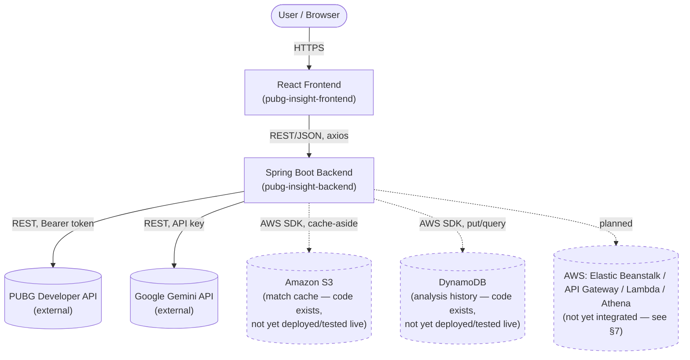

**Hard rule enforced today, verified by code inspection**: the frontend has exactly one external call surface (`src/api/axios.ts`, `baseURL = VITE_API_BASE_URL`). It never imports or calls PUBG/Gemini/AWS directly — every such call happens through the backend.

---

## 2. Component View (Backend Package Structure)

The backend is organized **by feature, not by technical layer** (see `CLAUDE.md` → Backend Package Structure). Arrows show compile-time dependencies (which package imports which).

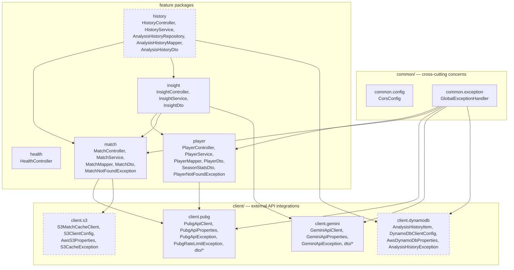

`insight` and `history` are higher-level features that compose other features (calling their public `Service` classes directly, reusing orchestration already built) rather than duplicating that logic — `insight` composes `player`+`match`; `history` composes `match`+`insight`. This is different from the sibling `player`/`match` relationship — they don't depend on each other, but a feature that needs others is free to depend on them.

Notable design point: `common.exception` depends on every feature/client whose exceptions it catches, but the feature packages never depend on each other in a cycle, and none of them depend back on `common.exception`. This keeps features independent of one another — a change to `match/` cannot break `player/`.

`client.s3` and `client.dynamodb` (dashed above) have real code — see §7 — but have not been deployed or tested against real AWS yet; `match`'s dependency on `s3` and `history`'s dependency on `ddb` are both live in the codebase today, just unverified end-to-end.

### Frontend structure

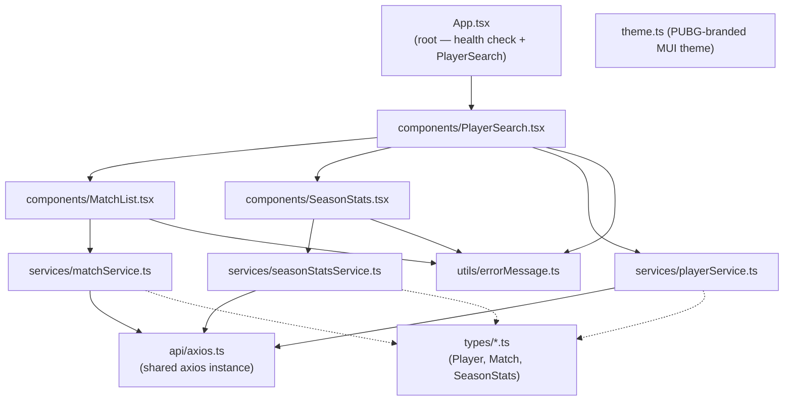

Each `service/*.ts` file mirrors exactly one backend controller's response shape via its matching `types/*.ts` interface — this pairing is intentional and should be kept in lockstep whenever a backend DTO changes.

---

## 3. Sequence Diagrams (per feature)

### 3.1 Player Search

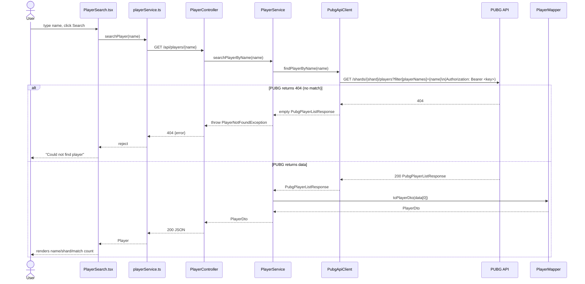

### 3.2 Match Analytics

Depends on Player Search having already run — `playerId` (PUBG account id) and a `matchId` (from `recentMatchIds`) are both already in the frontend's hands.

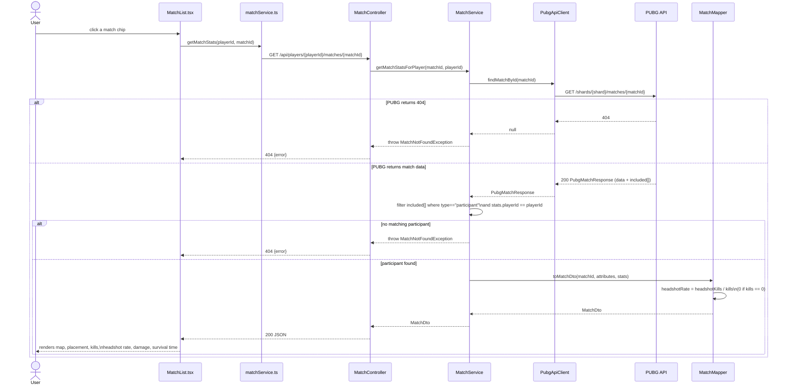

### 3.3 Season Stats (Win Rate)

Win rate cannot be derived from a single match — it is a season-level aggregate. This is a separate endpoint, fetched independently when a player is found (see Design Decision D5).

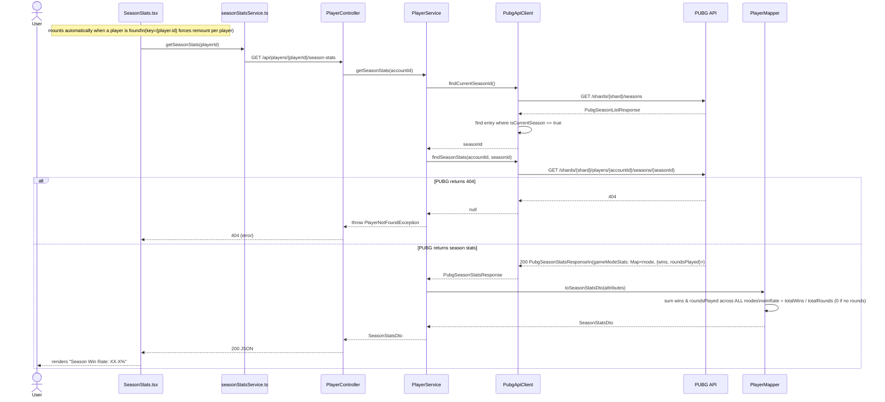

### 3.4 AI Insights (Gemini)

Composes Match Analytics and Season Stats — Gemini receives only the already-aggregated numbers those two produce, never raw match telemetry (per `CLAUDE.md` → AI Integration Principles).

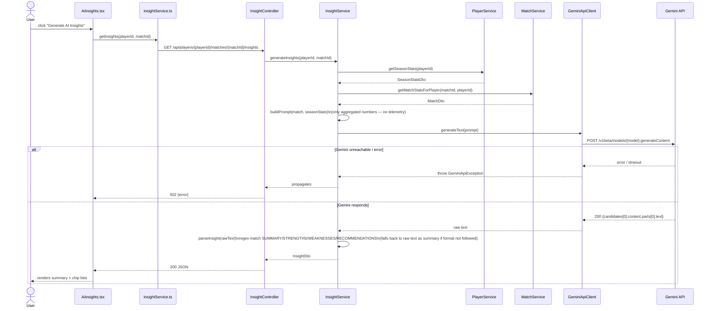

### 3.5 Match caching (S3) — not yet deployed, code only

Modifies the Match Analytics flow (§3.2): a cache-aside check runs before calling PUBG, since a completed match's data is immutable and not player-specific — one cached object serves every player who looks up that match.

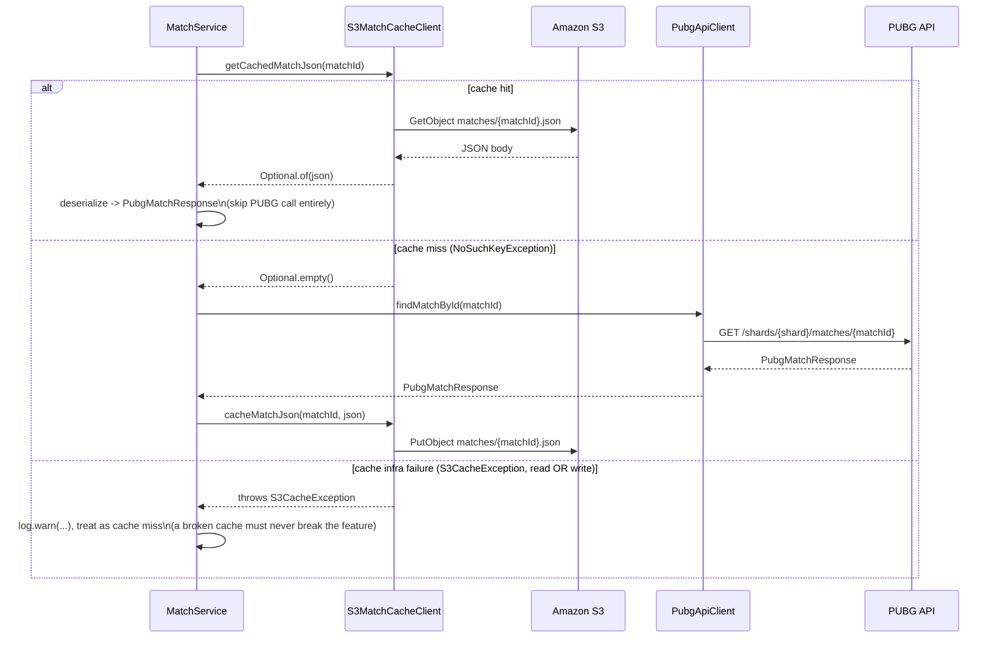

### 3.6 Recording analysis history (DynamoDB) — not yet deployed, code only

User-triggered (not automatic) — saves a computed match+insight result so it can be retrieved later, without needing to re-fetch from PUBG/Gemini.

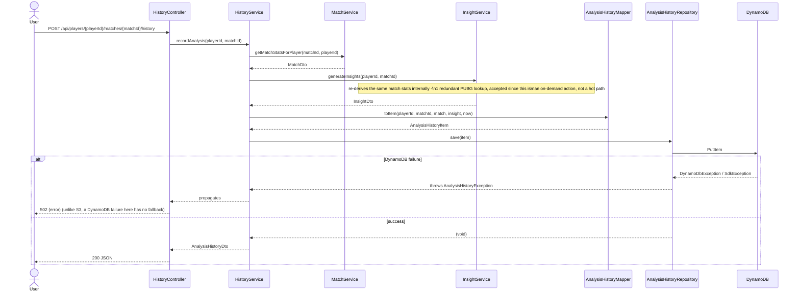

---

## 4. Data Mapping (PUBG raw JSON:API → internal DTOs)

PUBG's API follows the [JSON:API](https://jsonapi.org/) spec — deeply nested `data`/`attributes`/`relationships`/`included` objects. This app never exposes that shape to the frontend; every raw shape is mapped to a small, flat DTO by a dedicated `*Mapper` class.

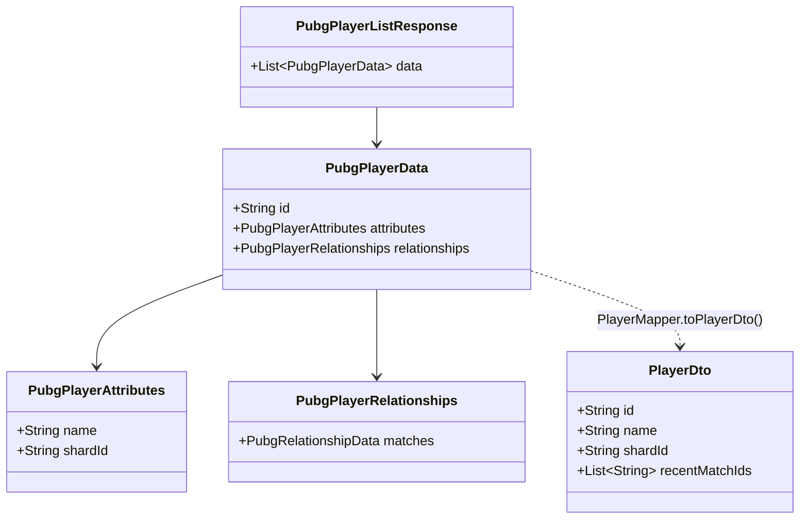

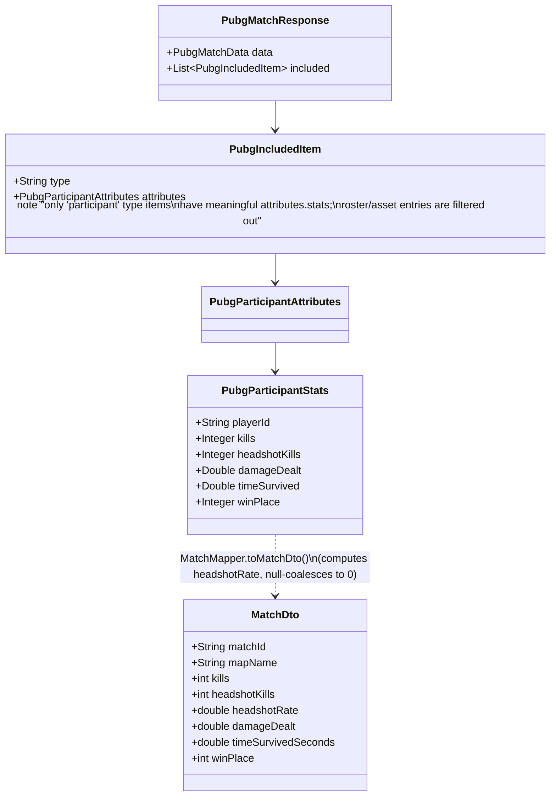

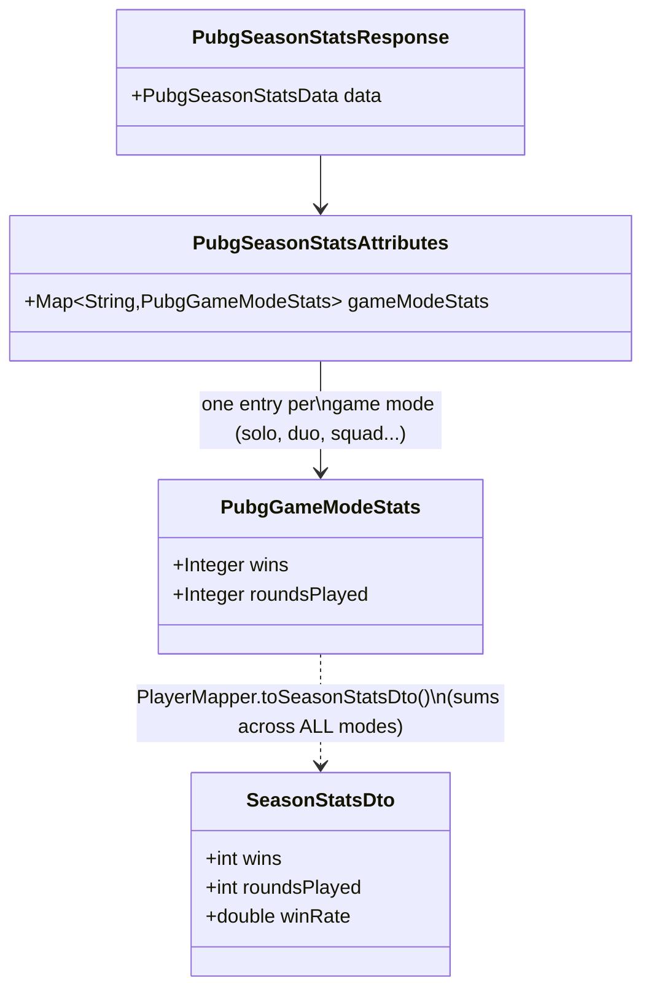

---

## 5. Error Handling Flow

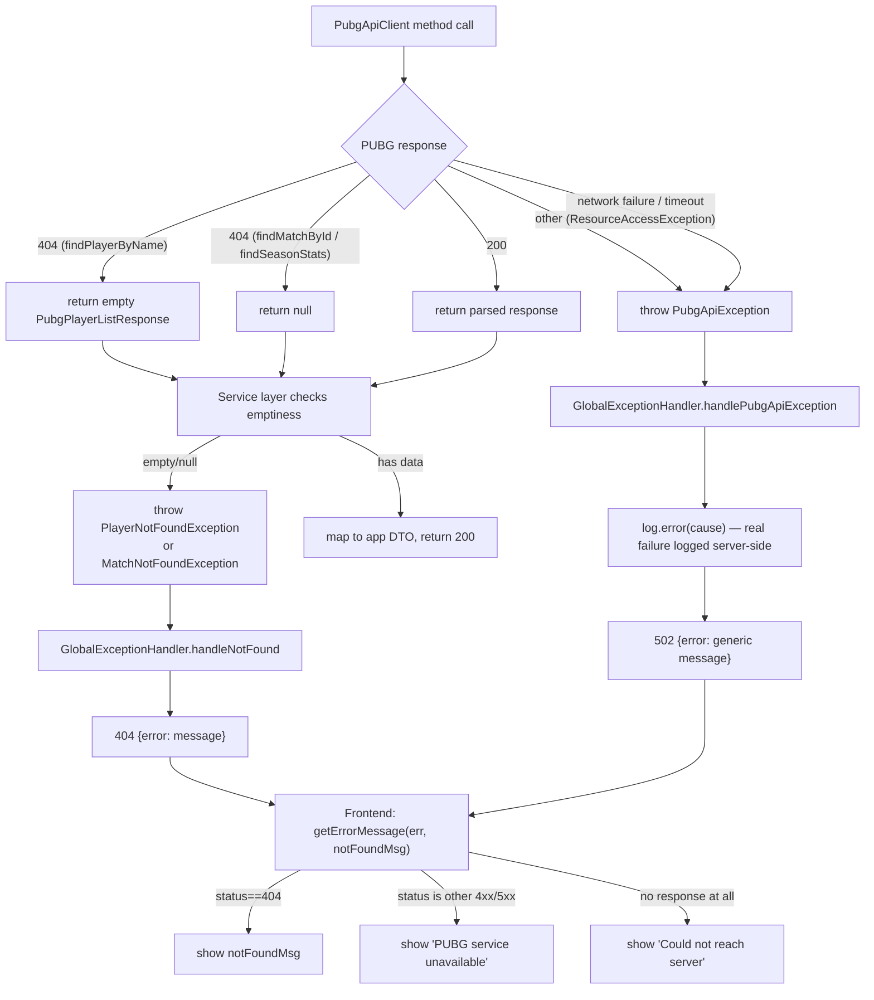

Two things this diagram makes visible that weren't true until today's fixes:
- The `ResourceAccessException` branch (network failure / timeout) didn't exist before — such failures used to escape uncaught into a generic Spring 500.
- The `log.error(cause)` step didn't exist before — `PubgApiException`'s real cause used to be silently discarded, which is exactly what made an earlier real debugging session (an empty API key producing an opaque 502) take much longer than it should have.

---

## 6. Design Decisions

Each entry: **Decision** — what was chosen. **Context** — why it came up. **Rationale** — why this option won. **Trade-off** — what was given up.

**D1 — Feature-based packages, not layer-based.**
Context: original scaffold used top-level `controller/`, `service/`, `dto/` etc. Rationale: everything a feature needs (controller, service, mapper, DTO, exceptions) lives together; adding a feature never means touching five different folders, and a feature can be understood by reading one directory. Trade-off: shared infrastructure (CORS, exception handling) needed its own `common/` package, and there's now a `PlayerNotFoundException`/`MatchNotFoundException` pair that look similar by design (see D2) rather than being unified.

**D2 — `PubgApiClient` never throws feature-specific exceptions.**
Context: discovered while building Match Analytics — the client originally threw `PlayerNotFoundException` on a 404, which is a `player`-package type the shared client shouldn't know about. Rationale: the client only understands PUBG's HTTP semantics (404, 5xx, network failure); each feature's *service* decides what "not found" means for it. Trade-off: every service that wraps a list/nullable client response has to repeat a small "if empty/null, throw" check — accepted as cheap and explicit rather than abstracting it prematurely.

**D3 — Spring's `RestClient`, synchronous, with explicit timeouts.**
Context: the app uses `spring-boot-starter-webmvc` (Servlet stack), not WebFlux — there's no reactive requirement anywhere in this app's scope. Rationale: `RestClient` is the modern synchronous HTTP client that fits the existing MVC stack without pulling in a reactive dependency for no reason. A 3s connect / 5s read timeout was added after the QA audit found none was set, meaning a hung PUBG response could hang a request thread indefinitely.

**D4 — 404 on list/nullable endpoints is normalized inside the client, not thrown.**
Context: PUBG returns HTTP 404 for "no player matches this name" and "no such match," which are normal, expected outcomes, not exceptional ones from the client's point of view. Rationale: `findPlayerByName` returns an empty list, `findMatchById`/`findSeasonStats` return `null`; the calling service decides whether that's a real error. Keeps the client's contract simple ("I always give you a parsed response or throw for a genuine failure").

**D5 — Win Rate is a separate endpoint (`/season-stats`), not bundled into Player Search or deferred to DynamoDB.**
Context: Win Rate is a required Match Analytics metric but can't be computed from a single match. Two alternatives were considered: (a) wait for Analysis History (DynamoDB) to aggregate stats from matches the user has viewed, (b) call PUBG's own season-stats endpoint. Rationale: (a) would only reflect the small subset of matches a user happened to click through this app — an inaccurate, incomplete win rate — and would block on AWS work not yet started. (b) gives PUBG's own authoritative season aggregate immediately, with no AWS dependency. Trade-off: costs two extra PUBG API calls (seasons list + season stats) per player, and PUBG doesn't return one lifetime figure — it returns a breakdown per game mode (see D6).

**D6 — Win rate is summed across all game modes into one number.**
Context: PUBG's season-stats response breaks wins/roundsPlayed down per mode (solo, duo, squad, and their FPP variants). Rationale: explicit product decision — a single combined number is simpler to read on a demo screen than six separate per-mode rates. Trade-off: a player who is excellent in squads but never plays solo will show a "blended" rate rather than their best mode's true rate.

**D7 — `application-local.yml` for secrets, not `.env`.**
Context: an early attempt used `.env` with `${PUBG_API_KEY:}` in `application-local.yml`, which silently resolved to an empty string because **Spring Boot does not read `.env` files** (that's a Vite/Node convention, not a Java one) — this caused a real, time-consuming 502 debugging session. Rationale: put the real value directly into the already-gitignored `application-local.yml`; Spring's profile mechanism (`spring.profiles.active: local`) loads it automatically regardless of how the app is launched (terminal vs IDE run button), avoiding the "env var set in one terminal, app launched from a different process" class of bug.

**D8 — AWS deployment target is the RMIT-provided Learner Lab, not a personal AWS account.**
Context: assignment requires real AWS usage but a personal account carries unpredictable real-money billing risk. Rationale: the Learner Lab is provided specifically for this coursework, with a fixed budget and no card-billing risk. Consequence: the not-yet-built AWS integration must use the Lab's pre-provisioned IAM role (no custom role/policy creation allowed) and expect compute to stop between sessions — mitigated for Elastic Beanstalk specifically because it hands out a stable URL that survives the underlying instance restarting.

**D9 — Frontend error messages are classified by HTTP response shape, not left generic.**
Context: QA audit found `PlayerSearch`/`MatchList`/`SeasonStats` all showed one generic message regardless of whether the real cause was "not found," "PUBG down," or "backend unreachable" — actively misleading for the second and third cases. Rationale: a small shared `getErrorMessage(err, notFoundMessage)` util branches on `err.response?.status` so a real backend outage no longer looks identical to "that player doesn't exist."

**D10 — `insight` composes `player` and `match` rather than re-fetching PUBG data itself.**
Context: AI Insights needs both season context (win rate) and a specific match's stats — both already exist as `PlayerService`/`MatchService` methods. Rationale: calling those services directly reuses the exact same PUBG-fetching, mapping, and error-handling logic instead of duplicating it inside `InsightService`; `insight` depends on `player` and `match`, but neither of those depends back on `insight` or on each other (see D1's note that this is a different relationship from sibling-feature coupling). Trade-off: generating one insight now makes at minimum 4 PUBG calls (player search is separate; season list + season stats + match) plus 1 Gemini call — acceptable for an on-demand, user-triggered action, not something to call automatically per match.

**D11 — Gemini's output is parsed with a tolerant fallback, not trusted to always follow the requested format.**
Context: the prompt asks Gemini to respond in a fixed `SUMMARY:`/`STRENGTHS:`/`WEAKNESSES:`/`RECOMMENDATIONS:` format so the backend can parse it into structured fields — but an LLM's adherence to a requested format isn't guaranteed. Rationale: `InsightService.parseInsight` regex-matches each label; if `SUMMARY:` isn't found at all (format not followed), the whole raw response is returned as the summary with empty lists rather than throwing an error — a partially-useful degraded response beats a failed request for something inherently a little fuzzy.

**D12 — S3 cache failures are soft-failed; DynamoDB history failures are not.**
Context: both are AWS dependencies that can fail (misconfigured credentials, missing table/bucket, network issues), but they play different roles. Rationale: S3 is purely an optimization — if the cache is broken, `MatchService` can still get a correct answer by calling PUBG directly, so `S3CacheException` is caught and logged inside `MatchService` itself and never reaches `GlobalExceptionHandler` (see D2's precedent: a client only understands its own service's semantics; here, the *feature* also decides a cache outage means nothing to the caller). DynamoDB, by contrast, has no fallback for `HistoryService.recordAnalysis` — if the save fails, there's no "correct answer" to give the user besides an error, so `AnalysisHistoryException` propagates and gets a real 502 from `GlobalExceptionHandler`. Trade-off: this makes the two AWS integrations look inconsistent at first glance (one swallows errors, one doesn't) unless you read this rationale — worth explaining in the demo/report rather than leaving implicit.

**D13 — `HistoryService` re-derives data by calling `MatchService`/`InsightService` again, accepting one redundant PUBG call.**
Context: recording history needs the same match stats and insight `InsightController`'s endpoints already computed moments earlier in the same user flow. Rationale: reusing the existing services' composition (same pattern as D10) avoids duplicating PUBG-fetching/parsing logic in a third place; the cost is that `InsightService.generateInsights` internally re-calls `MatchService.getMatchStatsForPlayer`, so one `POST .../history` costs an extra PUBG match lookup beyond what was already spent generating the insight the user reviewed before deciding to save it. Accepted because saving history is an explicit, infrequent user action (not a hot path), and because the S3 match cache (D12) means that redundant lookup is often a cache hit anyway, costing zero extra PUBG calls once a match has been looked up once.

---

## 7. Not Yet Built (Planned Architecture)

The following are part of the approved architecture (`PROJECT_CONTEXT.md`). Status per service, verified against actual code:

- **DynamoDB (analysis history)** and **S3 (match cache)** — **application code exists** (`client.dynamodb`, `client.s3`, and the `history` feature package are wired into `MatchService`/a new `HistoryController`). None of it has been deployed or run against a real AWS account yet — no table or bucket exists, and the code was written without network access to even compile it in the environment it was written in. Treat it as "ready to test," not "verified working."
- **Elastic Beanstalk, API Gateway, Lambda, Athena** — no code yet at all.

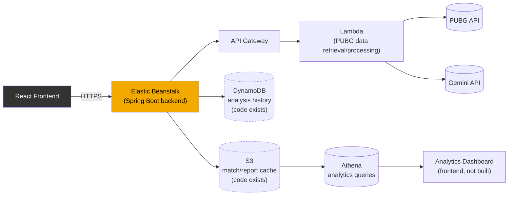

All of the above must be triggered by application code — never a manual Console/CLI step — per the rubric's automation requirement (`CLAUDE.md` → Automation is graded, manual setup is not). The DynamoDB/S3 code already follows this: `HistoryController`/`MatchService` call the AWS SDK directly, with no manual Console step in the runtime path — only the one-time table/bucket creation (allowed) remains a human action.

### What's needed to actually turn DynamoDB/S3 on

1. Confirm the Learner Lab's region (`docs/PROJECT_CONTEXT.md` has a TODO placeholder) and set `AWS_REGION`.
2. Create the DynamoDB table (name matches `DYNAMODB_ANALYSIS_HISTORY_TABLE`, default `pubg-insight-analysis-history`) with partition key `playerId` (String) and sort key `matchId` (String) — one-time Console setup, allowed under the rubric.
3. Create the S3 bucket (name matches `S3_CACHE_BUCKET`, default `pubg-insight-match-cache`) — same, one-time setup.
4. Ensure the runtime environment (local run, or eventually Elastic Beanstalk) can resolve AWS credentials — the code relies on the SDK's default credential provider chain (Learner Lab's `LabRole` when deployed; locally, whatever `~/.aws/credentials` or environment variables are configured).
5. Run `mvn compile`/`mvn test` for the first time with real network access — neither agent that wrote this code could do so in this project's development environment; the AWS SDK v2 class/method names used are believed correct but unverified against the real dependency.

---

## 8. Known Limitations / Technical Debt

Carried over from the local-baseline QA audit; not blocking, but worth being aware of before building on top:

- `PubgApiClient` now serves three resource types (player, match, season) in one class — fine at its current size, worth splitting if a fourth (e.g. telemetry) is added.
- `findCurrentSeasonId()` is cached for the life of the app instance (no TTL/invalidation) — fixed after real usage showed a single player search cost 8 PUBG calls (1 player + 2 season-stats + 5 match previews), exhausting the 10 req/min free-tier limit after just 1-2 searches. Caching the season id removes 1 of those calls; a restart is needed to pick up an actual season change, which is an acceptable trade-off for a course project, not a production service.
- Match preview count (`PREVIEW_COUNT` in `MatchList.tsx`) is capped at 3 for the same rate-limit reason — a real per-search budget of roughly 1 (player) + 1 (season stats) + 3 (previews) = 5 calls, leaving headroom for ~2 searches/minute within the limit.
- **This project's Spring Boot 4.1.0 auto-configures a Jackson 3 mapper bean (`tools.jackson.databind.json.JsonMapper`), not a classic Jackson 2 `com.fasterxml.jackson.databind.ObjectMapper` bean.** Discovered via the first real `mvn test` run: `MatchService` originally constructor-injected `ObjectMapper`, expecting Spring to auto-configure one — it doesn't, in this version, so context startup failed with `NoSuchBeanDefinitionException`, cascading into 8 failing tests (every test that builds a real `MatchService`, directly or transitively). Fixed by having `MatchService` construct its own `ObjectMapper` instance directly rather than relying on Spring DI for that specific type (`pom.xml` already declares the classic `jackson-databind`/`jackson-core`/`jackson-annotations` dependencies explicitly, so the class itself is on the classpath — there's just no Spring-managed bean of it). **If any future code needs JSON (de)serialization, do the same** — don't assume `@Autowired ObjectMapper` will resolve in this project.
- First real `mvn compile`/`mvn test` run (see above) confirmed **compile succeeded across the entire codebase**, including all the DynamoDB/S3 code written without any ability to compile it beforehand — the AWS SDK v2 class/method names used were all correct. Only the one Jackson issue above caused test failures; nothing else did.
- `README.md` in both repos is stale (backend's still describes the old layer-based package plan and lists Spring Boot 3; frontend's is still the default Vite template) — this document supersedes them for architecture purposes, but the READMEs should eventually be updated to at least point here.
- `S3ClientConfig` and `DynamoDbClientConfig` each independently read `@Value("${aws.region}")` — harmless duplication (written by two separate, independently-run agents that didn't see each other's code) rather than a shared `AwsProperties` record. Worth consolidating if a third AWS service config is added, not urgent at two.
- Once DynamoDB/S3 are actually deployed, every existing `@SpringBootTest`-based integration test will, for the first time, construct real `S3Client`/`DynamoDbEnhancedClient` beans and (for tests that exercise `MatchService`) attempt a real (uncredentialed, in CI/local-without-AWS-config) S3 call that's expected to fail fast into the soft-fail path (D12) — functionally fine, but confirm it doesn't meaningfully slow down the test suite via credential-provider-chain timeouts.
