# PUBG Insight — Architecture Documentation

This document is the technical source of truth for how the system is actually built, verified directly against the current source code (not assumptions or prior planning docs). It is written to double as the base material for the assignment's **Solution Architecture Document** and **Project Report → System Architecture** section (see `PROJECT_CONTEXT.md` → Deliverables).

Diagrams use [Mermaid](https://mermaid.js.org/) syntax, which GitHub renders natively in Markdown previews. They go from a high-level system view down to file-level call detail, per level:

1. System Context — the whole system and its external dependencies
2. Component View — packages/modules and their dependencies
3. Sequence Diagrams — request-by-request runtime behavior, one per feature
4. Data Mapping — how PUBG's raw wire format becomes this app's DTOs
5. Error Handling Flow — exception paths end to end

---

## 1. System Context

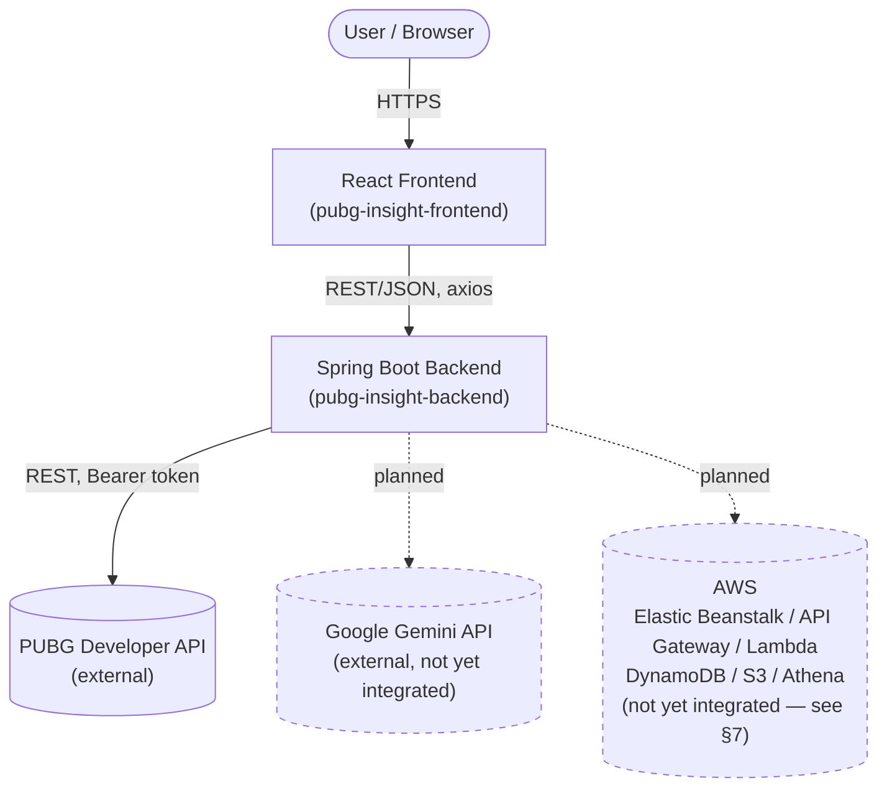

**Hard rule enforced today, verified by code inspection**: the frontend has exactly one external call surface (`src/api/axios.ts`, `baseURL = VITE_API_BASE_URL`). It never imports or calls PUBG/Gemini/AWS directly — every such call happens through the backend.

---

## 2. Component View (Backend Package Structure)

The backend is organized **by feature, not by technical layer** (see `CLAUDE.md` → Backend Package Structure). Arrows show compile-time dependencies (which package imports which).

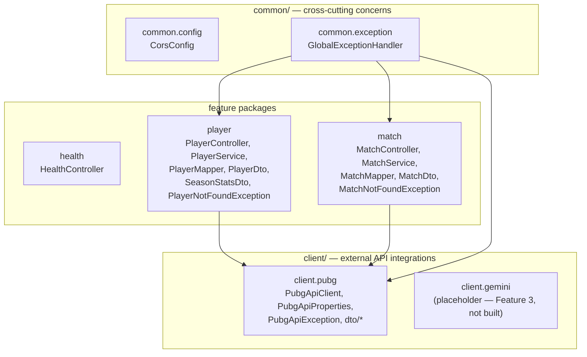

Notable design point: `common.exception` depends on `player` and `match` (to catch their exceptions), but `player` and `match` never depend on each other, and neither depends on `common.exception`. This keeps features independent of one another — a change to `match/` cannot break `player/`.

### Frontend structure

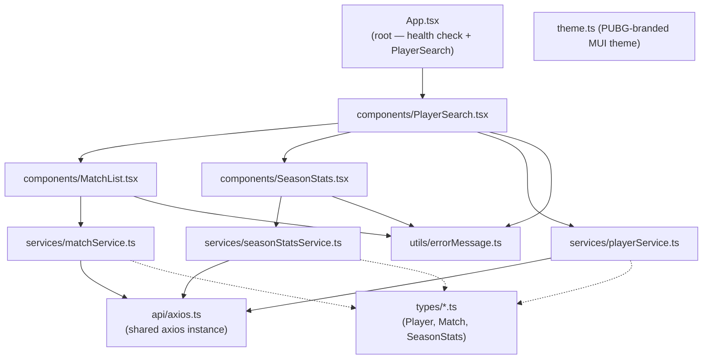

Each `service/*.ts` file mirrors exactly one backend controller's response shape via its matching `types/*.ts` interface — this pairing is intentional and should be kept in lockstep whenever a backend DTO changes.

---

## 3. Sequence Diagrams (per feature)

### 3.1 Player Search

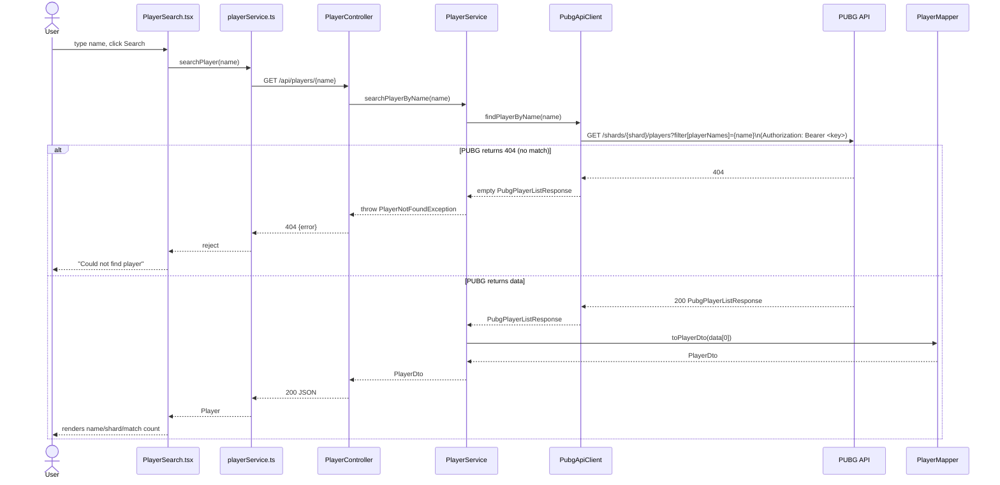

### 3.2 Match Analytics

Depends on Player Search having already run — `playerId` (PUBG account id) and a `matchId` (from `recentMatchIds`) are both already in the frontend's hands.

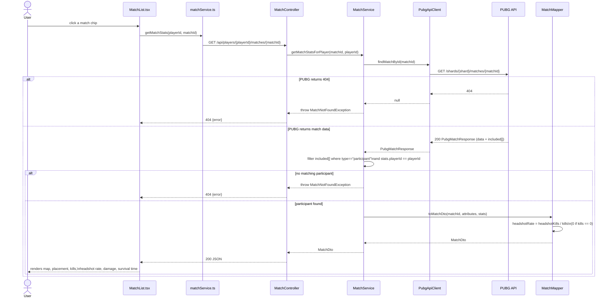

### 3.3 Season Stats (Win Rate)

Win rate cannot be derived from a single match — it is a season-level aggregate. This is a separate endpoint, fetched independently when a player is found (see Design Decision D5).

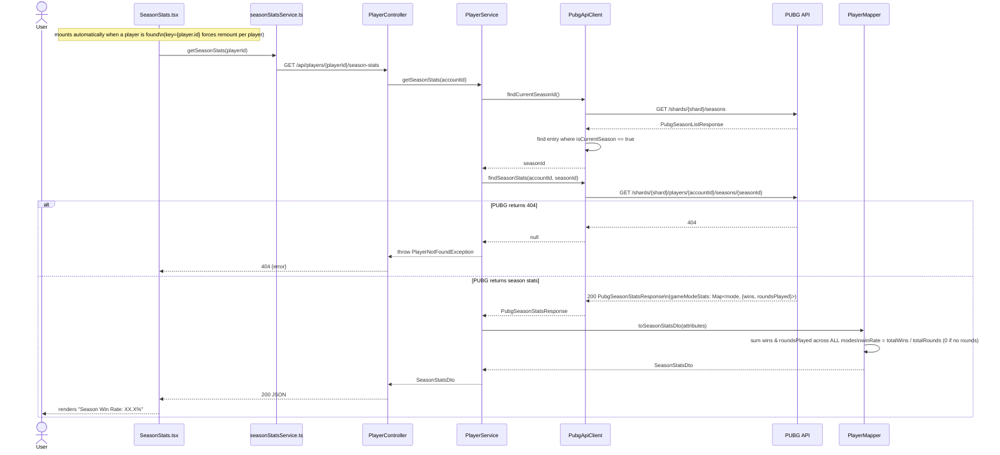

---

## 4. Data Mapping (PUBG raw JSON:API → internal DTOs)

PUBG's API follows the [JSON:API](https://jsonapi.org/) spec — deeply nested `data`/`attributes`/`relationships`/`included` objects. This app never exposes that shape to the frontend; every raw shape is mapped to a small, flat DTO by a dedicated `*Mapper` class.

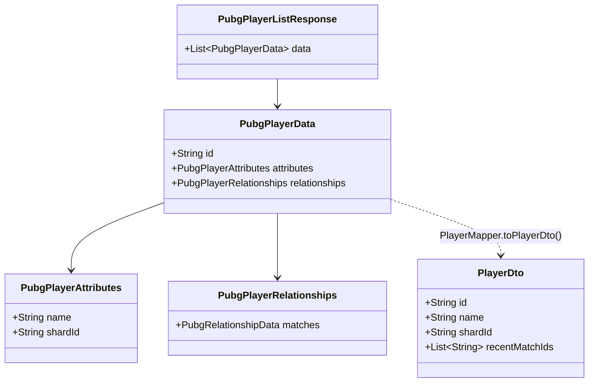

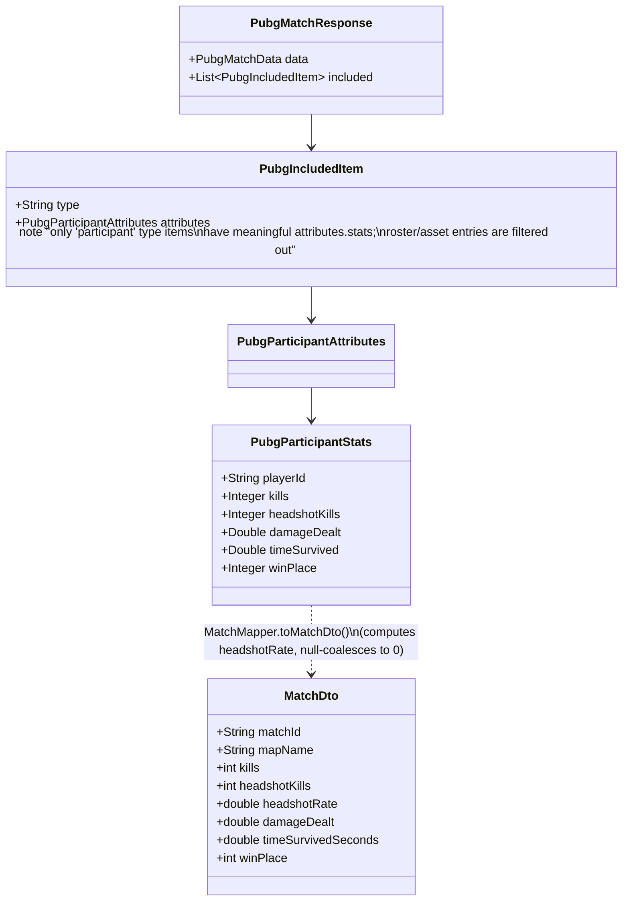

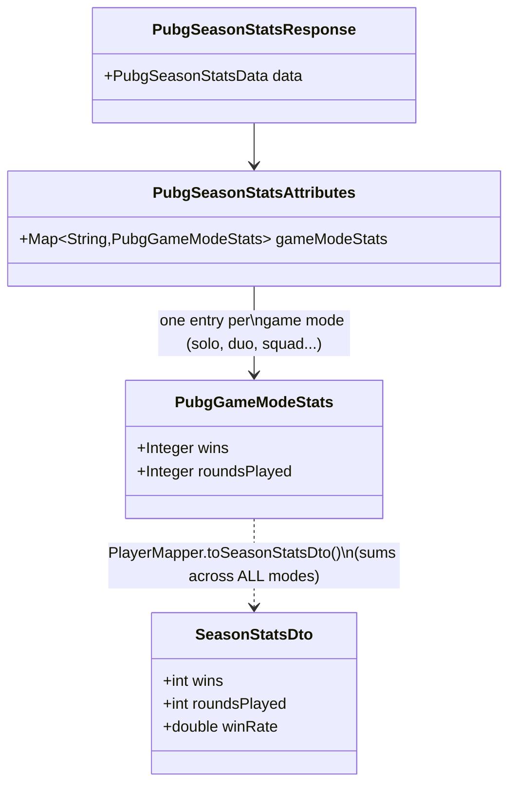

---

## 5. Error Handling Flow

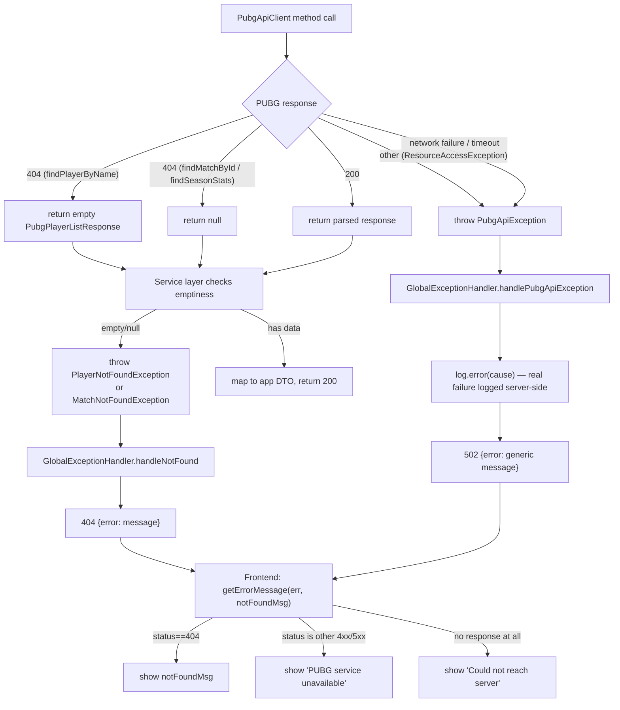

Two things this diagram makes visible that weren't true until today's fixes:
- The `ResourceAccessException` branch (network failure / timeout) didn't exist before — such failures used to escape uncaught into a generic Spring 500.
- The `log.error(cause)` step didn't exist before — `PubgApiException`'s real cause used to be silently discarded, which is exactly what made an earlier real debugging session (an empty API key producing an opaque 502) take much longer than it should have.

---

## 6. Design Decisions

Each entry: **Decision** — what was chosen. **Context** — why it came up. **Rationale** — why this option won. **Trade-off** — what was given up.

**D1 — Feature-based packages, not layer-based.**
Context: original scaffold used top-level `controller/`, `service/`, `dto/` etc. Rationale: everything a feature needs (controller, service, mapper, DTO, exceptions) lives together; adding a feature never means touching five different folders, and a feature can be understood by reading one directory. Trade-off: shared infrastructure (CORS, exception handling) needed its own `common/` package, and there's now a `PlayerNotFoundException`/`MatchNotFoundException` pair that look similar by design (see D2) rather than being unified.

**D2 — `PubgApiClient` never throws feature-specific exceptions.**
Context: discovered while building Match Analytics — the client originally threw `PlayerNotFoundException` on a 404, which is a `player`-package type the shared client shouldn't know about. Rationale: the client only understands PUBG's HTTP semantics (404, 5xx, network failure); each feature's *service* decides what "not found" means for it. Trade-off: every service that wraps a list/nullable client response has to repeat a small "if empty/null, throw" check — accepted as cheap and explicit rather than abstracting it prematurely.

**D3 — Spring's `RestClient`, synchronous, with explicit timeouts.**
Context: the app uses `spring-boot-starter-webmvc` (Servlet stack), not WebFlux — there's no reactive requirement anywhere in this app's scope. Rationale: `RestClient` is the modern synchronous HTTP client that fits the existing MVC stack without pulling in a reactive dependency for no reason. A 3s connect / 5s read timeout was added after the QA audit found none was set, meaning a hung PUBG response could hang a request thread indefinitely.

**D4 — 404 on list/nullable endpoints is normalized inside the client, not thrown.**
Context: PUBG returns HTTP 404 for "no player matches this name" and "no such match," which are normal, expected outcomes, not exceptional ones from the client's point of view. Rationale: `findPlayerByName` returns an empty list, `findMatchById`/`findSeasonStats` return `null`; the calling service decides whether that's a real error. Keeps the client's contract simple ("I always give you a parsed response or throw for a genuine failure").

**D5 — Win Rate is a separate endpoint (`/season-stats`), not bundled into Player Search or deferred to DynamoDB.**
Context: Win Rate is a required Match Analytics metric but can't be computed from a single match. Two alternatives were considered: (a) wait for Analysis History (DynamoDB) to aggregate stats from matches the user has viewed, (b) call PUBG's own season-stats endpoint. Rationale: (a) would only reflect the small subset of matches a user happened to click through this app — an inaccurate, incomplete win rate — and would block on AWS work not yet started. (b) gives PUBG's own authoritative season aggregate immediately, with no AWS dependency. Trade-off: costs two extra PUBG API calls (seasons list + season stats) per player, and PUBG doesn't return one lifetime figure — it returns a breakdown per game mode (see D6).

**D6 — Win rate is summed across all game modes into one number.**
Context: PUBG's season-stats response breaks wins/roundsPlayed down per mode (solo, duo, squad, and their FPP variants). Rationale: explicit product decision — a single combined number is simpler to read on a demo screen than six separate per-mode rates. Trade-off: a player who is excellent in squads but never plays solo will show a "blended" rate rather than their best mode's true rate.

**D7 — `application-local.yml` for secrets, not `.env`.**
Context: an early attempt used `.env` with `${PUBG_API_KEY:}` in `application-local.yml`, which silently resolved to an empty string because **Spring Boot does not read `.env` files** (that's a Vite/Node convention, not a Java one) — this caused a real, time-consuming 502 debugging session. Rationale: put the real value directly into the already-gitignored `application-local.yml`; Spring's profile mechanism (`spring.profiles.active: local`) loads it automatically regardless of how the app is launched (terminal vs IDE run button), avoiding the "env var set in one terminal, app launched from a different process" class of bug.

**D8 — AWS deployment target is the RMIT-provided Learner Lab, not a personal AWS account.**
Context: assignment requires real AWS usage but a personal account carries unpredictable real-money billing risk. Rationale: the Learner Lab is provided specifically for this coursework, with a fixed budget and no card-billing risk. Consequence: the not-yet-built AWS integration must use the Lab's pre-provisioned IAM role (no custom role/policy creation allowed) and expect compute to stop between sessions — mitigated for Elastic Beanstalk specifically because it hands out a stable URL that survives the underlying instance restarting.

**D9 — Frontend error messages are classified by HTTP response shape, not left generic.**
Context: QA audit found `PlayerSearch`/`MatchList`/`SeasonStats` all showed one generic message regardless of whether the real cause was "not found," "PUBG down," or "backend unreachable" — actively misleading for the second and third cases. Rationale: a small shared `getErrorMessage(err, notFoundMessage)` util branches on `err.response?.status` so a real backend outage no longer looks identical to "that player doesn't exist."

---

## 7. Not Yet Built (Planned Architecture)

The following are part of the approved architecture (`PROJECT_CONTEXT.md`) but have no code yet. Included here so this document stays the single reference as they land.

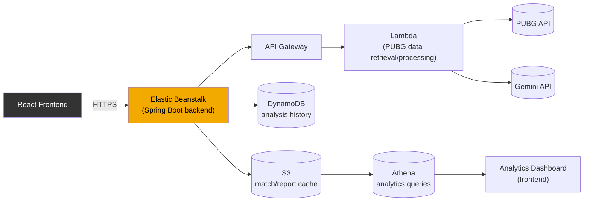

All of the above must be triggered by application code — never a manual Console/CLI step — per the rubric's automation requirement (`CLAUDE.md` → Automation is graded, manual setup is not).

---

## 8. Known Limitations / Technical Debt

Carried over from the local-baseline QA audit; not blocking, but worth being aware of before building on top:

- `PubgApiClient` now serves three resource types (player, match, season) in one class — fine at its current size, worth splitting if a fourth (e.g. telemetry) is added.
- No caching of `findCurrentSeasonId()` — it's re-fetched on every season-stats call even though seasons change roughly every 2-3 months. Acceptable for now; would matter at real traffic volume.
- Backend unit tests exist for the mapper/service classes (see `src/test/java`) but could not be compiled/run in the environment they were written in — verify with `mvn test` before relying on them.
- `README.md` in both repos is stale (backend's still describes the old layer-based package plan and lists Spring Boot 3; frontend's is still the default Vite template) — this document supersedes them for architecture purposes, but the READMEs should eventually be updated to at least point here.
