# PUBG Insight — Architecture Documentation

This document is the technical source of truth for how the system is actually built, verified directly against the current source code (not assumptions or prior planning docs). It is written to double as the base material for the assignment's **Solution Architecture Document** and **Project Report → System Architecture** section (see `PROJECT_CONTEXT.md` → Deliverables).

Diagrams use [Mermaid](https://mermaid.js.org/) syntax, which GitHub renders natively in Markdown previews. They go from a high-level system view down to file-level call detail, per level:

1. System Context — the whole system and its external dependencies
2. Component View — packages/modules and their dependencies
3. Sequence Diagrams — request-by-request runtime behavior, one per feature
4. Data Mapping — how PUBG's raw wire format becomes this app's DTOs
5. Error Handling Flow — exception paths end to end
6. Design Decisions — the decision log (D1–Dn)
7. Full AWS Architecture — every deployed AWS service, how it's wired, and why

---

## 1. System Context

Every AWS service below is live, deployed to a real personal AWS account (D17), and invoked by the app's own code — none of this is console-only or planned. See §7 for the full deployed topology and §6 for the design decisions behind each addition.

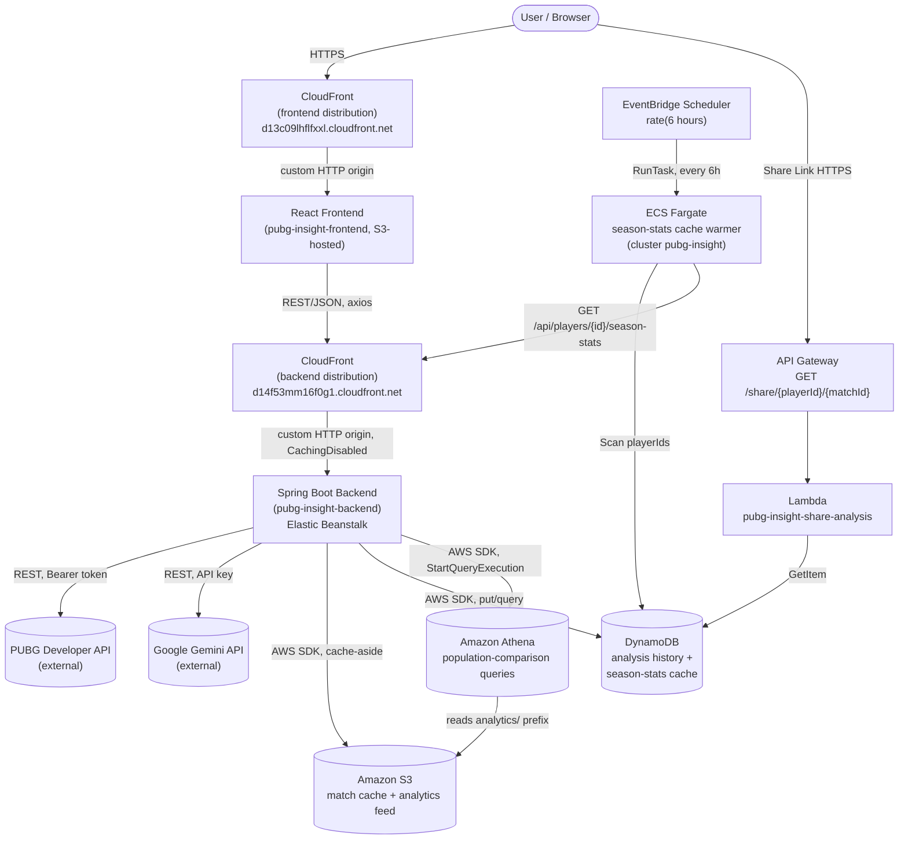

**Hard rule enforced today, verified by code inspection**: the frontend has exactly one external call surface (`src/api/axios.ts`, `baseURL = VITE_API_BASE_URL`, now pointed at the backend CloudFront distribution) plus one deliberate second surface for the share feature (`VITE_SHARE_API_BASE_URL`, the API Gateway domain, used only by `AiInsights.tsx`'s "Copy Share Link" button to build a URL — the frontend never calls Lambda's DynamoDB read directly, it just links to the public page Lambda renders). Neither PUBG nor Gemini nor any other AWS service is ever called directly from the browser — every such call happens through the backend or the standalone Lambda.

---

## 2. Component View (Backend Package Structure)

The backend is organized **by feature, not by technical layer**. Arrows show compile-time dependencies (which package imports which).

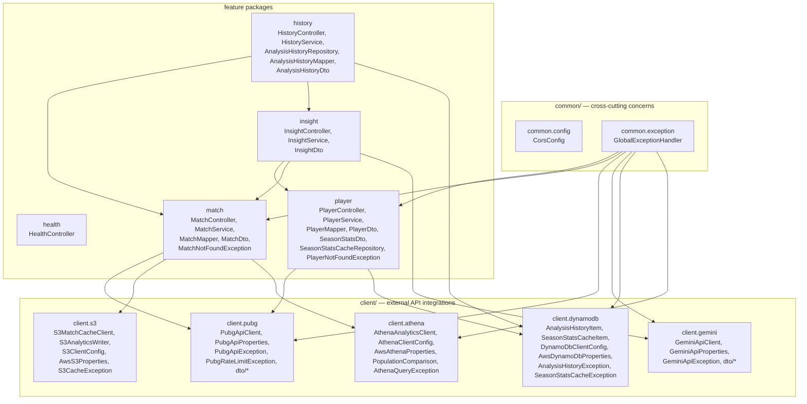

`insight` and `history` are higher-level features that compose other features (calling their public `Service` classes directly, reusing orchestration already built) rather than duplicating that logic — `insight` composes `player`+`match`; `history` composes `match`+`insight`. This is different from the sibling `player`/`match` relationship — they don't depend on each other, but a feature that needs others is free to depend on them.

Notable design point: `common.exception` depends on every feature/client whose exceptions it catches, but the feature packages never depend on each other in a cycle, and none of them depend back on `common.exception`. This keeps features independent of one another — a change to `match/` cannot break `player/`.

All of `client.s3`, `client.dynamodb`, and `client.athena` are deployed and verified live end-to-end (see §7) — `match`'s dependency on `s3` (match cache + the new analytics feed) and `athena` (population comparison), and `player`'s new dependency on `ddb` (season-stats cache-aside, alongside `history`'s pre-existing one for analysis history) are all exercised by real production traffic, not just present in the codebase.

### Frontend structure

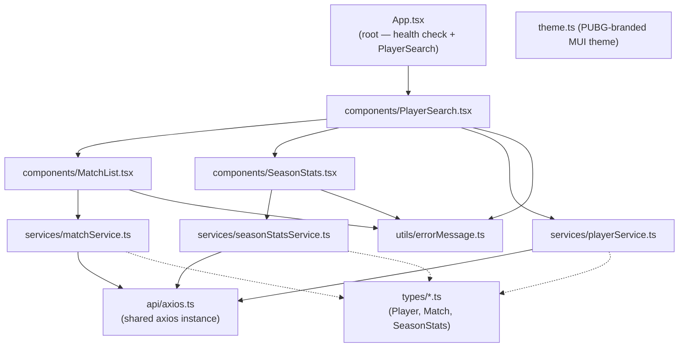

Each `service/*.ts` file mirrors exactly one backend controller's response shape via its matching `types/*.ts` interface — this pairing is intentional and should be kept in lockstep whenever a backend DTO changes.

---

## 3. Sequence Diagrams (per feature)

### 3.1 Player Search

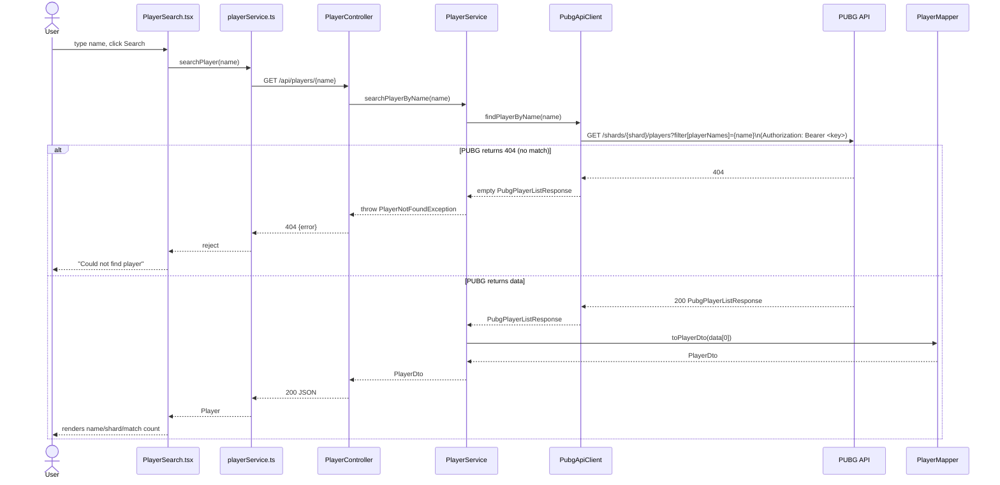

### 3.2 Match Analytics

Depends on Player Search having already run — `playerId` (PUBG account id) and a `matchId` (from `recentMatchIds`) are both already in the frontend's hands.

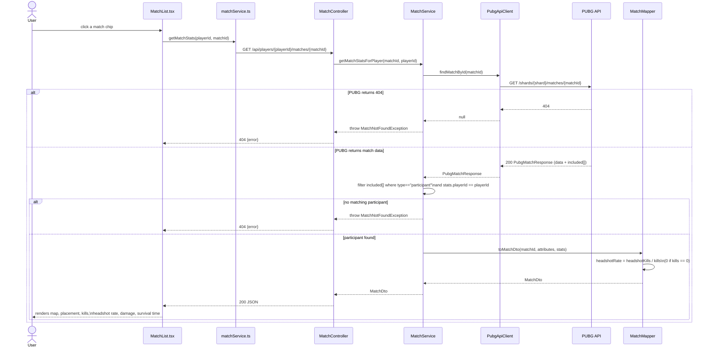

### 3.3 Season Stats (Win Rate)

Win rate cannot be derived from a single match — it is a season-level aggregate. This is a separate endpoint, fetched independently when a player is found (see Design Decision D5). A DynamoDB read-through cache (`pubg-insight-season-stats-cache`, 1-hour TTL, D22) now sits in front of the PUBG calls below — added specifically so the ECS Fargate cache warmer (§3.9) has somewhere to write, and so repeat visits to an already-searched player cost zero PUBG calls for up to an hour.

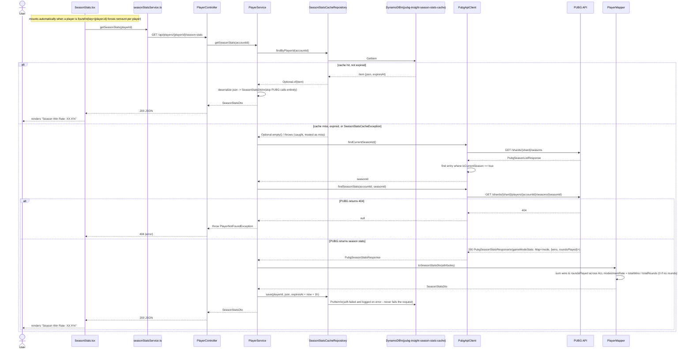

### 3.4 AI Insights (Gemini)

Composes Match Analytics and Season Stats — Gemini receives only the already-aggregated numbers those two produce, never raw match telemetry.

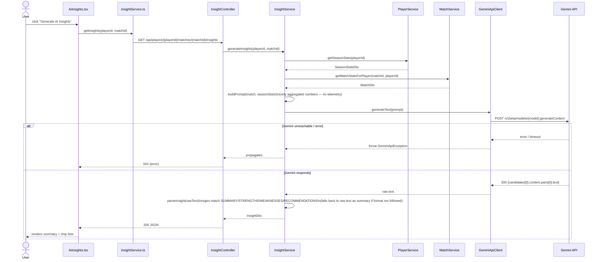

### 3.5 Match caching (S3) + analytics feed write

Modifies the Match Analytics flow (§3.2): a cache-aside check runs before calling PUBG, since a completed match's data is immutable and not player-specific — one cached object serves every player who looks up that match. Every successful lookup (cache hit or miss) also fires a best-effort write to a second, separate S3 prefix (`analytics/{matchId}-{playerId}.json`) via `S3AnalyticsWriter` — a flat, per-player record purpose-built for Athena (§3.8), kept deliberately separate from the raw JSON:API match cache below because that raw shape is fragile to query (mixed `included[]` item types).

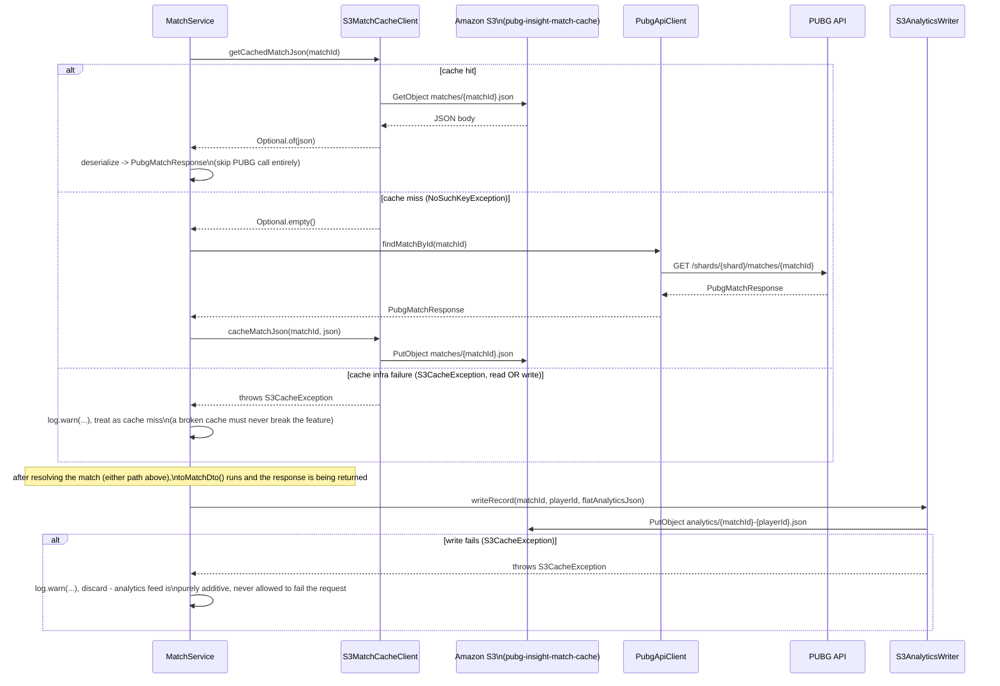

### 3.6 Recording analysis history (DynamoDB)

User-triggered (not automatic) — saves a computed match+insight result so it can be retrieved later, without needing to re-fetch from PUBG/Gemini.

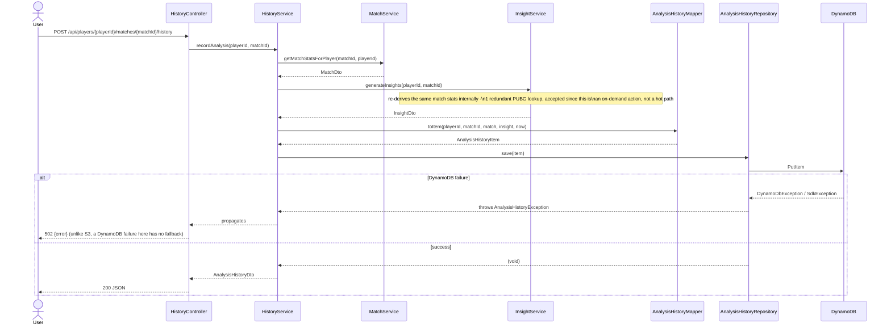

### 3.7 Share Analysis (Lambda + API Gateway)

Entirely independent of the Spring Boot monolith — a standalone Node.js 20.x Lambda (`pubg-insight-share-analysis`) behind an API Gateway HTTP API, reading the same `pubg-insight-analysis-history` DynamoDB table the main backend's `AnalysisHistoryRepository` writes to, via its own direct `GetItem` call and its own least-privilege IAM role (`pubg-insight-share-lambda-role`, `dynamodb:GetItem` only). Triggered from a real "Copy Share Link" button in `AiInsights.tsx` — the link is built client-side (deterministic from `playerId`/`matchId`, no network call needed to construct it) and only resolved when someone actually opens it.

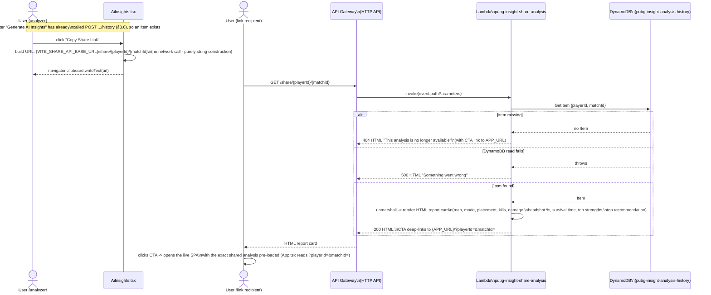

### 3.8 Population Comparison (Athena)

Closes the population-baseline gap D18 documents: radar scores are still scaled against a fixed ceiling (no change there), but this is a second, additional metric — how this match's damage compares to the median of every match this app has ever analyzed for the same game mode, computed live from the S3 analytics feed (§3.5) via a real Athena query, not a fixed number.

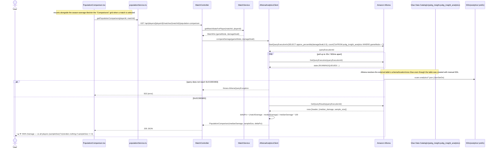

### 3.9 Season-Stats Cache Warmer (ECS Fargate + EventBridge Scheduler)

A standalone containerized job, not a second copy of the backend — it only ever calls the backend's own already-existing `/season-stats` endpoint, exactly as a real user's browser would, so it reuses every bit of caching/rate-limit logic already built (§3.3) rather than duplicating it.

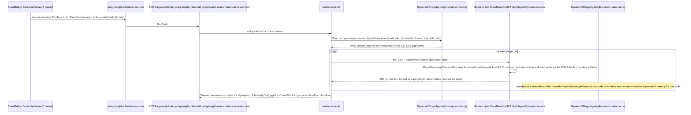

---

## 4. Data Mapping (PUBG raw JSON:API → internal DTOs)

PUBG's API follows the [JSON:API](https://jsonapi.org/) spec — deeply nested `data`/`attributes`/`relationships`/`included` objects. This app never exposes that shape to the frontend; every raw shape is mapped to a small, flat DTO by a dedicated `*Mapper` class.

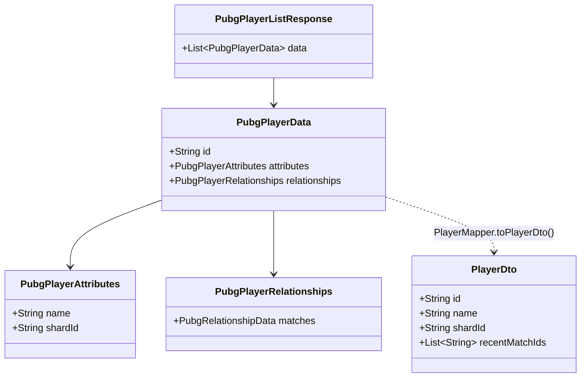

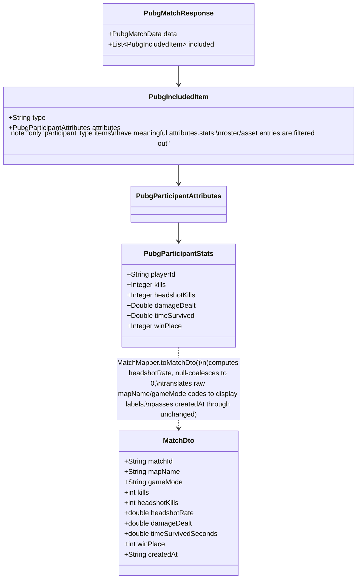

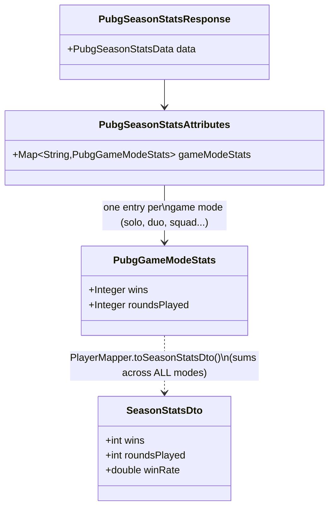

---

## 5. Error Handling Flow

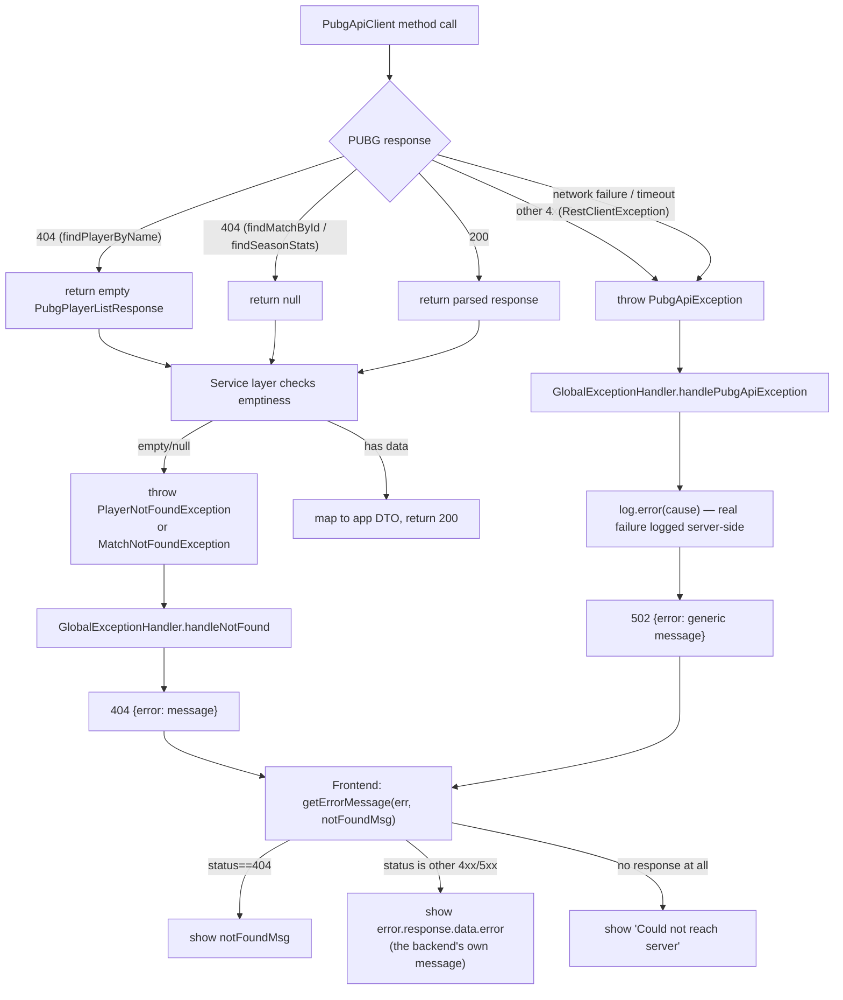

Two things this diagram makes visible that weren't true until an earlier fix:
- The generic network-failure branch didn't exist at all before — such failures used to escape uncaught into a generic Spring 500.
- The `log.error(cause)` step didn't exist before — `PubgApiException`'s real cause used to be silently discarded, which is exactly what made an earlier real debugging session (an empty API key producing an opaque 502) take much longer than it should have.

That branch was originally implemented as `catch (HttpStatusCodeException | ResourceAccessException e)`, which turned out to be an incomplete fix: a real production log showed a Gemini read timeout that occurred *while Spring was still reading the response body* (`RestClient`'s `readWithMessageConverters`) throwing a plain `RestClientException` — not a `ResourceAccessException` — which is only thrown for I/O failures during request *execution* (connect/send). That plain `RestClientException` fell through both branches of the union catch and reached the servlet container uncaught, producing a raw Spring error body instead of `GeminiApiException` → 502. Both `PubgApiClient` and `GeminiApiClient` now catch `RestClientException` itself (the common superclass of `HttpStatusCodeException`, `ResourceAccessException`, and everything else `RestClient` can throw) instead of enumerating subtypes — `PubgApiClient` had the identical gap, just not yet triggered, since its 5s read timeout leaves less time for a slow body to trip this path than Gemini's 15s one.

`GeminiApiException`/`GeminiRateLimitException` follow the exact same shape as the `PubgApiException`/`PubgRateLimitException` branches shown above (502 for a generic Gemini failure, 429 + `Retry-After` for Gemini's own rate limit), each with its own distinct message. The frontend step `O` used to hardcode `"PUBG service unavailable"` for *any* non-404/429 response — which meant a Gemini failure was shown to the user as a PUBG failure, since both happened to map to the same HTTP status. `getErrorMessage` now reads the backend's actual `error` message instead of guessing from the status code, so this is fixed for every current and future exception type without the frontend needing to know about each one individually.

---

## 6. Design Decisions

Each entry: **Decision** — what was chosen. **Context** — why it came up. **Rationale** — why this option won. **Trade-off** — what was given up.

**D1 — Feature-based packages, not layer-based.**
Context: original scaffold used top-level `controller/`, `service/`, `dto/` etc. Rationale: everything a feature needs (controller, service, mapper, DTO, exceptions) lives together; adding a feature never means touching five different folders, and a feature can be understood by reading one directory. Trade-off: shared infrastructure (CORS, exception handling) needed its own `common/` package, and there's now a `PlayerNotFoundException`/`MatchNotFoundException` pair that look similar by design (see D2) rather than being unified.

**D2 — `PubgApiClient` never throws feature-specific exceptions.**
Context: discovered while building Match Analytics — the client originally threw `PlayerNotFoundException` on a 404, which is a `player`-package type the shared client shouldn't know about. Rationale: the client only understands PUBG's HTTP semantics (404, 5xx, network failure); each feature's *service* decides what "not found" means for it. Trade-off: every service that wraps a list/nullable client response has to repeat a small "if empty/null, throw" check — accepted as cheap and explicit rather than abstracting it prematurely.

**D3 — Spring's `RestClient`, synchronous, with explicit timeouts.**
Context: the app uses `spring-boot-starter-webmvc` (Servlet stack), not WebFlux — there's no reactive requirement anywhere in this app's scope. Rationale: `RestClient` is the modern synchronous HTTP client that fits the existing MVC stack without pulling in a reactive dependency for no reason. A 3s connect / 5s read timeout was added after the QA audit found none was set, meaning a hung PUBG response could hang a request thread indefinitely.

**D4 — 404 on list/nullable endpoints is normalized inside the client, not thrown.**
Context: PUBG returns HTTP 404 for "no player matches this name" and "no such match," which are normal, expected outcomes, not exceptional ones from the client's point of view. Rationale: `findPlayerByName` returns an empty list, `findMatchById`/`findSeasonStats` return `null`; the calling service decides whether that's a real error. Keeps the client's contract simple ("I always give you a parsed response or throw for a genuine failure").

**D5 — Win Rate is a separate endpoint (`/season-stats`), not bundled into Player Search or deferred to DynamoDB.**
Context: Win Rate is a required Match Analytics metric but can't be computed from a single match. Two alternatives were considered: (a) wait for Analysis History (DynamoDB) to aggregate stats from matches the user has viewed, (b) call PUBG's own season-stats endpoint. Rationale: (a) would only reflect the small subset of matches a user happened to click through this app — an inaccurate, incomplete win rate — and would block on AWS work not yet started. (b) gives PUBG's own authoritative season aggregate immediately, with no AWS dependency. Trade-off: costs two extra PUBG API calls (seasons list + season stats) per player, and PUBG doesn't return one lifetime figure — it returns a breakdown per game mode (see D6).

**D6 — Win rate is summed across all game modes into one number.**
Context: PUBG's season-stats response breaks wins/roundsPlayed down per mode (solo, duo, squad, and their FPP variants). Rationale: explicit product decision — a single combined number is simpler to read on a demo screen than six separate per-mode rates. Trade-off: a player who is excellent in squads but never plays solo will show a "blended" rate rather than their best mode's true rate.

**D7 — `application-local.yml` for secrets, not `.env`.**
Context: an early attempt used `.env` with `${PUBG_API_KEY:}` in `application-local.yml`, which silently resolved to an empty string because **Spring Boot does not read `.env` files** (that's a Vite/Node convention, not a Java one) — this caused a real, time-consuming 502 debugging session. Rationale: put the real value directly into the already-gitignored `application-local.yml`; Spring's profile mechanism (`spring.profiles.active: local`) loads it automatically regardless of how the app is launched (terminal vs IDE run button), avoiding the "env var set in one terminal, app launched from a different process" class of bug.

**D8 — AWS deployment target is the RMIT-provided Learner Lab, not a personal AWS account.** *(Superseded by D17.)*
Context: assignment requires real AWS usage but a personal account carries unpredictable real-money billing risk. Rationale: the Learner Lab is provided specifically for this coursework, with a fixed budget and no card-billing risk. Consequence: the not-yet-built AWS integration must use the Lab's pre-provisioned IAM role (no custom role/policy creation allowed) and expect compute to stop between sessions — mitigated for Elastic Beanstalk specifically because it hands out a stable URL that survives the underlying instance restarting.

**D9 — Frontend error messages are classified by HTTP response shape, not left generic.**
Context: QA audit found `PlayerSearch`/`MatchList`/`SeasonStats` all showed one generic message regardless of whether the real cause was "not found," "PUBG down," or "backend unreachable" — actively misleading for the second and third cases. Rationale: a small shared `getErrorMessage(err, notFoundMessage)` util branches on `err.response?.status` so a real backend outage no longer looks identical to "that player doesn't exist."

**D10 — `insight` composes `player` and `match` rather than re-fetching PUBG data itself.**
Context: AI Insights needs both season context (win rate) and a specific match's stats — both already exist as `PlayerService`/`MatchService` methods. Rationale: calling those services directly reuses the exact same PUBG-fetching, mapping, and error-handling logic instead of duplicating it inside `InsightService`; `insight` depends on `player` and `match`, but neither of those depends back on `insight` or on each other (see D1's note that this is a different relationship from sibling-feature coupling). Trade-off: generating one insight now makes at minimum 4 PUBG calls (player search is separate; season list + season stats + match) plus 1 Gemini call — acceptable for an on-demand, user-triggered action, not something to call automatically per match.

**D11 — Gemini's output is parsed with a tolerant fallback, not trusted to always follow the requested format.**
Context: the prompt asks Gemini to respond in a fixed `SUMMARY:`/`STRENGTHS:`/`WEAKNESSES:`/`RECOMMENDATIONS:` format so the backend can parse it into structured fields — but an LLM's adherence to a requested format isn't guaranteed. Rationale: `InsightService.parseInsight` regex-matches each label; if `SUMMARY:` isn't found at all (format not followed), the whole raw response is returned as the summary with empty lists rather than throwing an error — a partially-useful degraded response beats a failed request for something inherently a little fuzzy.

**D12 — S3 cache failures are soft-failed; DynamoDB history failures are not.**
Context: both are AWS dependencies that can fail (misconfigured credentials, missing table/bucket, network issues), but they play different roles. Rationale: S3 is purely an optimization — if the cache is broken, `MatchService` can still get a correct answer by calling PUBG directly, so `S3CacheException` is caught and logged inside `MatchService` itself and never reaches `GlobalExceptionHandler` (see D2's precedent: a client only understands its own service's semantics; here, the *feature* also decides a cache outage means nothing to the caller). DynamoDB, by contrast, has no fallback for `HistoryService.recordAnalysis` — if the save fails, there's no "correct answer" to give the user besides an error, so `AnalysisHistoryException` propagates and gets a real 502 from `GlobalExceptionHandler`. Trade-off: this makes the two AWS integrations look inconsistent at first glance (one swallows errors, one doesn't) unless you read this rationale — worth explaining in the demo/report rather than leaving implicit.

**D13 — `HistoryService` re-derives data by calling `MatchService`/`InsightService` again, accepting one redundant PUBG call.**
Context: recording history needs the same match stats and insight `InsightController`'s endpoints already computed moments earlier in the same user flow. Rationale: reusing the existing services' composition (same pattern as D10) avoids duplicating PUBG-fetching/parsing logic in a third place; the cost is that `InsightService.generateInsights` internally re-calls `MatchService.getMatchStatsForPlayer`, so one `POST .../history` costs an extra PUBG match lookup beyond what was already spent generating the insight the user reviewed before deciding to save it. Accepted because saving history is an explicit, infrequent user action (not a hot path), and because the S3 match cache (D12) means that redundant lookup is often a cache hit anyway, costing zero extra PUBG calls once a match has been looked up once.

**D14 — `GeminiApiClient` gets its own rate-limit exception, mirroring `PubgApiClient`'s.**
Context: Gemini's free tier rate-limits requests just like PUBG's does, but until now a Gemini 429 fell into the same generic 502 branch as every other Gemini failure, reading as a hard failure instead of "try again shortly." Rationale: `GeminiRateLimitException` copies `PubgRateLimitException`'s shape exactly (same `Retry-After` parsing helper, same 429 + header response) — a genuinely useful case, not an invented one, since the same production rate-limit issue already happened once on the PUBG side of this exact codebase (see the `findCurrentSeasonId()` caching note in §8).

**D15 — Frontend surfaces the backend's own error message instead of re-deriving one from the HTTP status code.**
Context: a real bug was found where a Gemini 403 (misconfigured API key) reached the user as "PUBG service is temporarily unavailable" — `GlobalExceptionHandler` already returned a correct, distinct message per exception type, but `errorMessage.ts` ignored the response body and hardcoded a status-based string instead. Rationale: fixing the frontend to read `error.response.data.error` makes every current and future backend exception type automatically distinguishable to the user, with the message defined in exactly one place (the exception handler) instead of two places that can drift out of sync.

**D17 — Switched from the Learner Lab to a personal AWS account (Free Tier + $100 promotional credit).**
Context: the Learner Lab's session-expiring credentials (manual refresh every few hours from the "AWS Details" panel) and no-custom-IAM-role restriction (D8) became too much practical friction this close to the submission deadline. Rationale: a personal account trades away the Lab's zero-billing-risk safety net for permanent credentials (one-time IAM user + access key, never expiring) and full freedom to create IAM roles/policies per service, removing the recurring per-session setup step entirely. Consequence: real billing risk is now live (mitigated by the $100 credit + Free Tier + a Billing alarm) and the downloaded access-key CSV is a genuine permanent secret that must never be committed, unlike the Lab's self-expiring session token which was low-risk if briefly exposed.

**D16 — PUBG rate limiting is enforced backend-side (`PubgRateLimiter`, blocking), not frontend-side (pacing/backoff).**
Context: the frontend went through two iterations trying to stay under PUBG's 10 req/min limit purely by pacing its own requests (a background queue with a fixed interval, tuned twice after real 429s). This has a fundamental flaw: the 10 req/min budget belongs to the app's single shared PUBG API key, not to any one browser tab - two tabs, or two people using the demo at once, each pacing "safely" on their own can still collectively blow the shared budget, since neither has visibility into the other's calls. Rationale: `PubgRateLimiter` (a single `@Component`, one instance for the whole app) tracks a sliding 60s window of call timestamps and makes `PubgApiClient.acquire()` **block** the calling thread until a slot is free, instead of either side guessing a safe pace or reactively handling a 429 after the fact. This is the one place that can actually see and gate every outgoing PUBG call regardless of which HTTP request triggered it. Blocking a request thread for a few seconds is an acceptable trade-off at this app's scale (a handful of concurrent demo users, not a production service under load) - a slower response reads to the user as normal loading, not as a failure. The existing `PubgRateLimitException`/429 handling (D-something in §5) is kept as a safety net for the case PUBG's own window doesn't line up exactly with this app's, not removed. Trade-off: the frontend's pacing/background-load logic is now redundant for correctness (the backend guarantees the budget either way) - it's been simplified back down to pagination, which is now purely a UX choice (bounding how many matches load onscreen at once) rather than a rate-limit workaround.

**D18 — Radar/skill scoring uses fixed, documented ceilings and a season-aggregate proxy for "Consistency," not percentile/z-score population normalization or true match-to-match variance.**
Context: a rigorous skill-scoring methodology (percentile ranking, z-score against a population baseline, or a literal variance/standard-deviation "consistency" measure across recent matches) would be more statistically defensible, but PUBG's season-stats endpoint (`PubgSeasonStatsAttributes`/`PubgGameModeStats`) only exposes **season-aggregate sums** (total kills, total damage, total rounds, etc.) for the queried player - it does not expose other players' data (no population to compute a percentile/z-score against) or a per-match breakdown (no distribution to compute variance from) without fetching and aggregating every individual recent match, which costs one PUBG API call per match against the same 10 req/min shared budget that D16 already treats as this project's central constraint. Rationale: `PlayerMapper` scales each radar axis against a fixed, explicitly documented ceiling (e.g. `COMBAT_KILLS_PER_ROUND_CEILING = 2.0`) chosen as a rough "very strong player" reference point rather than a statistically derived one - honestly labeled as such in code comments, not presented as population-calibrated. The "Consistency" axis specifically uses `top10Rate` (how often the player finishes in the top 10 across the season) as a **season-level proxy** for consistency, not a literal per-match variance calculation - a real, meaningful signal (frequent top-10 finishes reflects reliably competitive play) but not the same thing as "low variance in damage/placement across recent matches," which is what "consistency" more precisely means statistically. Consequence: if asked to defend this in the demo/report, the honest answer is "this app has no cross-player population to normalize against, and computing true per-match variance would require an additional per-match-fetch aggregation step not yet built (see the frontend `CLAUDE.md`'s "Deep Insights" future-work entry, which needs the same kind of new backend aggregation endpoint) - the current scores are a deterministic, reproducible, documented approximation, not a fabricated one." This trade-off was made consciously to avoid two worse alternatives: inventing a fake population baseline, or looping per-match PUBG calls on every season-stats lookup (which would reintroduce the exact rate-limit problem D16 was built to solve). **Superseded in part by D21** — Athena's population comparison finally provides a real cross-player baseline for damage, though only as an additional metric alongside the radar, not a replacement for it (the radar still uses fixed ceilings; only the new "vs all players" damage tile uses the real population).

**D19 — Two CloudFront distributions (frontend and backend), each a custom HTTP origin rather than an S3-origin distribution.**
Context: the frontend was plain S3 static-website HTTP hosting with no CDN or HTTPS — a real, pre-existing gap independent of the rubric, and also the Networking & Content Delivery category gap the rubric scores separately. The natural-seeming approach — a single CloudFront distribution with the S3 bucket as an `S3Origin` — doesn't work here because S3 **website endpoints** (`*.s3-website-*.amazonaws.com`, needed for SPA routing via the bucket's index/error document configuration) don't support Origin Access Control; only S3 REST/API endpoints do. Rationale: front the S3 website endpoint as a custom HTTP origin instead (`OriginProtocolPolicy=http-only`, `ViewerProtocolPolicy=redirect-to-https`, CachingOptimized) — this still gets real HTTPS termination and edge caching at CloudFront, it's just not the S3-origin integration CloudFront is usually paired with. A second, separate distribution was then added in front of Elastic Beanstalk for a concrete reason discovered during live testing, not preemptively: once the SPA was served over HTTPS via the first distribution, browsers blocked its calls to the backend's plain-HTTP Elastic Beanstalk URL as mixed content. Fronting the backend with its own CloudFront distribution (also custom HTTP origin, since EB's default domain is also HTTP-only) fixes that by giving the backend an HTTPS URL too; `VITE_API_BASE_URL` now points at this second distribution instead of the raw EB URL. Trade-off: the backend distribution must use `CachingDisabled` + the `AllViewer` origin request policy instead of `CachingOptimized`, since every backend response is per-player/per-match dynamic data that must never be cached at the edge (a stale cached player search or match lookup would be a real correctness bug, not just a UX one) — this also means the backend distribution adds a small, real amount of extra request latency (an edge hop that does no caching) compared to hitting Elastic Beanstalk directly, accepted purely to solve the mixed-content problem.

**D20 — Share Analysis feature is a standalone Lambda + API Gateway HTTP API, deliberately independent of the Spring Boot monolith, not a new endpoint on the existing backend.**
Context: this closes two things at once — the Compute (bonus) category gap from adding a second, genuinely distinct compute service type, and a real, previously-identified product gap: the original project brief asked to investigate "asynchronous/background processing if appropriate" for reducing PUBG API load, which was never built. Rationale: a shareable, read-only summary of an already-saved analysis (`pubg-insight-analysis-history`, written by `HistoryService`, D12/D13) doesn't need any of the Spring Boot app's PUBG/Gemini orchestration — it only needs one `GetItem` and some HTML rendering, which is exactly what Lambda is for, and keeping it a separate deployable means a bug or outage in the monolith can't take down already-shared links. `GeminiApiClient`/`PubgApiClient` are never invoked from this path at all — the Lambda only reads data the main app already computed and saved. Trade-off: two codebases now read the same DynamoDB table with two independent access patterns (`AnalysisHistoryRepository`'s Enhanced Client mapping vs. the Lambda's raw `GetItemCommand` + manual `unmarshall`) — a schema change to `AnalysisHistoryItem` must be manually kept in sync with the Lambda's expectations (`item.mapName`, `item.strengths`, etc.), since there's no shared type between a Java repository and a Node.js function. Accepted because the item shape is simple and infrequently changed, and because the alternative (a shared library or a call back into the monolith) would reintroduce the same coupling this decision exists to avoid.

**D21 — Athena queries a separate, purpose-built S3 analytics feed rather than the existing raw match cache, via a manually-defined Glue-backed external table.**
Context: this closes the Analytics category gap, and directly answers D18's honestly-documented limitation — "this app has no cross-player population to normalize against." The existing S3 match cache (`matches/{matchId}.json`, D12) already amounts to an accidental data lake of every match ever looked up, but its shape is PUBG's raw JSON:API format (`data`/`included[]` with mixed item types) — directly queryable by Athena in principle, but painful (every query would need to filter `included[]` by `type == "participant"` inline). Rationale: `S3AnalyticsWriter` writes a second, flat, purpose-built record per match+player lookup to a separate `analytics/` prefix specifically so Athena's SQL stays simple (`SELECT approx_percentile(damageDealt, 0.5), count(*) ... WHERE gameMode = ?`), and `AthenaAnalyticsClient` exposes it as a real, on-demand query triggered by `GET /api/players/{playerId}/matches/{matchId}/population-comparison` — not a report run manually in the console. The external table (`pubg_insight.pubg_insight_analytics`, `org.openx.data.jsonserde.JsonSerDe`) is Glue-backed even though it was created with manual DDL rather than a crawler, which is why the EB instance role needs `glue:GetTable`/`GetDatabase` in addition to the Athena permissions — Athena always resolves table metadata through Glue, regardless of how the table was defined. Trade-off: the analytics feed only starts accumulating population data from the moment `S3AnalyticsWriter` shipped, so early in the app's life `sampleSize` is small and the frontend tile (`PopulationComparison.tsx`) intentionally renders nothing at `sampleSize === 0` rather than showing a misleadingly confident percentage from one or two data points; Athena's query latency (typically a few seconds, per the polling loop's `MAX_POLL_ATTEMPTS`/`POLL_INTERVAL_MILLIS`) is also visibly slower than every other endpoint in this app, which is why that tile renders a loading skeleton instead of blocking the rest of the match view.

**D22 — ECS Fargate scheduled task warms the season-stats cache by calling the backend's own public endpoint, not by duplicating `PlayerService`'s PUBG-fetching logic in a second codebase.**
Context: this closes the Containers category gap, and — like D20 — traces back to the original brief's unaddressed "scheduled refresh" / rate-limit-protection ask. A new DynamoDB table, `pubg-insight-season-stats-cache` (partition key `playerId`, TTL attribute `expiresAt`), gives `PlayerService.getSeasonStats` a 1-hour read-through cache (mirroring the S3 cache-aside pattern from D12, but backed by DynamoDB since season stats are small structured JSON, not opaque blobs) so repeat visits to an already-searched player cost zero PUBG calls for up to an hour. Rationale: rather than write a second piece of code that calls PUBG's season-stats endpoints directly from the container (duplicating `PubgApiClient`, `PlayerMapper`, and the cache-write logic in a completely separate Node/Python/whatever runtime), `warm-cache.sh` does the simplest thing that actually works: `aws dynamodb scan` the existing `pubg-insight-analysis-history` table for every distinct `playerId` anyone has ever analyzed, then `curl` each one's `/api/players/{id}/season-stats` — the exact same endpoint a real browser calls, exercising the exact same code path (including D12-style soft-fail behavior) rather than a parallel one that could drift out of sync. The container itself is deliberately minimal: its `Dockerfile` copies the official `public.ecr.aws/aws-cli/aws-cli` image's CLI bundle onto a plain `amazonlinux:2` base (which already ships `curl`/`bash`) specifically to avoid any package-manager network calls at build time — a real constraint given this project's development environment has unreliable outbound network access. IAM follows the same deliberate, non-wildcard-where-avoidable pattern used everywhere else in this project (e.g. the EB instance role's scoped `AthenaAnalyticsAccess` policy, D21): `pubg-insight-season-stats-warmer-task-role` gets read-only `dynamodb:Scan` on the analysis-history table only (it never writes to either DynamoDB table directly — the cache write happens inside the backend's own request handling), `ecsTaskExecutionRole` is the standard `AmazonECSTaskExecutionRolePolicy` (ECR pull + CloudWatch Logs), and `pubg-insight-scheduler-ecs-role` grants EventBridge Scheduler only `ecs:RunTask`+`iam:PassRole` scoped to this one cluster/task-definition. Trade-off: the warmer is only useful once the backend is deployed with the cache-aside code live — running it against an older backend deployment would just generate six hours' worth of ordinary cache-miss PUBG traffic for no benefit, since there'd be nowhere for it to write. It also assumes recently-searched players are worth pre-warming; a player nobody has looked up yet gets no benefit until their first real search, which is the expected and accepted scope (this is rate-limit protection for repeat lookups, not a way to avoid the first PUBG call for a brand-new player).

---

## 7. Full AWS Architecture

Everything below is deployed to a real personal AWS account (`us-east-1`, D17) and verified working end-to-end — not planned, not console-only. This section replaces an earlier "Not Yet Built" section that described all of this as either code-only or entirely unbuilt; that's no longer true of anything listed here. The six AWS service categories this project's rubric scores are annotated below.

- **Compute** — Elastic Beanstalk (`pubg-insight-backend` / `Pubg-insight-backend-env`) runs the Spring Boot monolith. Deployed via `deploy.sh` (`mvn clean package` → S3 upload → `create-application-version` → `update-environment`), not a manual Console upload.
- **Compute, bonus (Lambda + API Gateway)** — `pubg-insight-share-analysis` (Node.js 20.x) behind an API Gateway HTTP API, `GET /share/{playerId}/{matchId}`. See §3.7.
- **Containers (ECS Fargate)** — `season-stats-cache-warmer`, a scheduled Fargate task in cluster `pubg-insight`, triggered every 6 hours by EventBridge Scheduler. See §3.9.
- **Storage (S3)** — `pubg-insight-frontend` (SPA static hosting) and `pubg-insight-match-cache` (three prefixes: `matches/`, `analytics/`, `athena-results/`).
- **Networking & Content Delivery (CloudFront)** — two distributions, one per S3/EB origin. See D19.
- **Database (DynamoDB)** — `pubg-insight-analysis-history` (pre-existing) and `pubg-insight-season-stats-cache` (new, D22).
- **Analytics (Athena)** — external table `pubg_insight.pubg_insight_analytics` over the S3 `analytics/` prefix, backed by the Glue Data Catalog. See §3.8, D21.
- **Third-party APIs** — PUBG Official API and Google Gemini API (unchanged, capped at 2 types by the rubric).

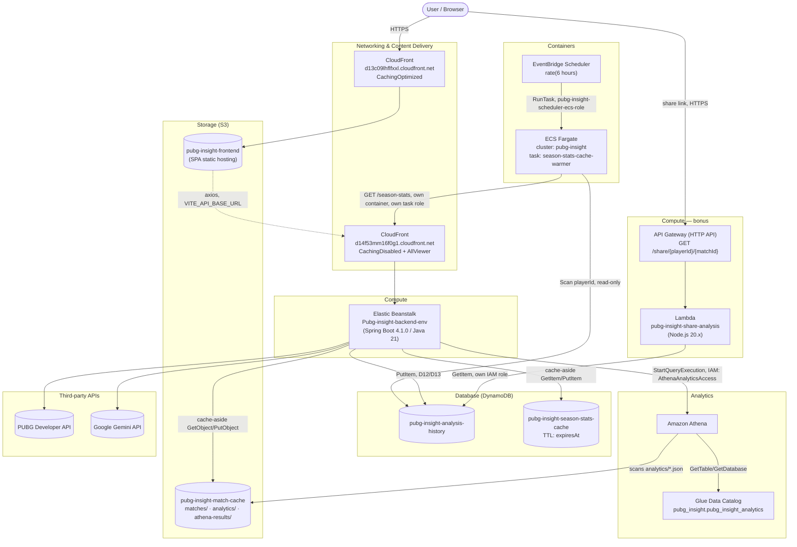

All of the above is triggered by application code — never a manual Console/CLI step — per the rubric's automation requirement (automation is graded, manual setup is not). The one-time exceptions, all allowed under the rubric, are infrastructure creation itself: table/bucket/distribution/cluster/function creation, the Glue table DDL, and the EventBridge Scheduler rule definition. Every runtime invocation — S3 GetObject/PutObject, DynamoDB GetItem/PutItem/Scan, Athena StartQueryExecution, Lambda invocation via API Gateway, ECS RunTask via EventBridge — is either the app's own code calling the AWS SDK directly, or one AWS-managed service invoking another on a schedule, with no human in the loop.

IAM, per service (each scoped deliberately, not a shared wildcard role — see D21/D22 for the reasoning behind each):

| Principal | Role | Grants |
|---|---|---|
| EB EC2 instances | `aws-elasticbeanstalk-ec2-role` | `AmazonS3FullAccess`, `AmazonDynamoDBFullAccess`, inline `AthenaAnalyticsAccess` (`athena:StartQueryExecution/GetQueryExecution/GetQueryResults`, `glue:GetTable/GetDatabase` scoped to the `pubg_insight` database/table) |
| Share Lambda | `pubg-insight-share-lambda-role` | `dynamodb:GetItem` only, on `pubg-insight-analysis-history` |
| ECS warmer task | `pubg-insight-season-stats-warmer-task-role` | `dynamodb:Scan` only, on `pubg-insight-analysis-history` |
| ECS task execution | `ecsTaskExecutionRole` | standard `AmazonECSTaskExecutionRolePolicy` (ECR pull, CloudWatch Logs) |
| EventBridge Scheduler | `pubg-insight-scheduler-ecs-role` | `ecs:RunTask` + `iam:PassRole`, scoped to the `pubg-insight` cluster / warmer task definition only |

Full one-time AWS resource checklist for everything above: `README.md` → "AWS Resources Required" (personal AWS account per D17).

---

## 8. Known Limitations / Technical Debt

Carried over from the local-baseline QA audit; not blocking, but worth being aware of before building on top:

- `PubgApiClient` now serves three resource types (player, match, season) in one class — fine at its current size, worth splitting if a fourth (e.g. telemetry) is added.
- `findCurrentSeasonId()` is cached for the life of the app instance (no TTL/invalidation) — fixed after real usage showed a single player search cost 8 PUBG calls (1 player + 2 season-stats + 5 match previews), exhausting the 10 req/min free-tier limit after just 1-2 searches. Caching the season id removes 1 of those calls; a restart is needed to pick up an actual season change, which is an acceptable trade-off for a course project, not a production service.
- Match preview count (`PREVIEW_COUNT` in `MatchList.tsx`) is capped at 3 for the same rate-limit reason — a real per-search budget of roughly 1 (player) + 1 (season stats) + 3 (previews) = 5 calls, leaving headroom for ~2 searches/minute within the limit. Matches beyond that count are shown as a click-to-reveal list rather than eagerly fetched or labeled by raw index — see D15's UI counterpart in the frontend `CLAUDE.md`.
- **A misconfigured/empty `GEMINI_API_KEY` produces a Gemini 403 "unregistered callers" error, not an obvious "key missing" error.** `gemini.api.key` resolves through `${GEMINI_API_KEY:placeholder-api-key}` (`application.yml`) then `${GEMINI_API_KEY:}` (`application-local.yml`, empty default) — if the env var isn't actually set wherever the app runs, the key silently becomes an empty string, `GeminiApiClient` still sends the request as `?key=`, and Google's API responds with a 403 that looks like an auth/permissions problem rather than "you forgot to set a variable." Confirmed as the root cause of a real reported issue. Fix is either exporting `GEMINI_API_KEY` in the actual run environment, or putting the literal key directly in `application-local.yml` (gitignored) the same way `PUBG_API_KEY` already works there — this is a local config issue, not something the code can detect and fix for you (an empty string is a valid config value, not a distinguishable error state).
- **This project's Spring Boot 4.1.0 auto-configures a Jackson 3 mapper bean (`tools.jackson.databind.json.JsonMapper`), not a classic Jackson 2 `com.fasterxml.jackson.databind.ObjectMapper` bean.** Discovered via the first real `mvn test` run: `MatchService` originally constructor-injected `ObjectMapper`, expecting Spring to auto-configure one — it doesn't, in this version, so context startup failed with `NoSuchBeanDefinitionException`, cascading into 8 failing tests (every test that builds a real `MatchService`, directly or transitively). Fixed by having `MatchService` construct its own `ObjectMapper` instance directly rather than relying on Spring DI for that specific type (`pom.xml` already declares the classic `jackson-databind`/`jackson-core`/`jackson-annotations` dependencies explicitly, so the class itself is on the classpath — there's just no Spring-managed bean of it). **If any future code needs JSON (de)serialization, do the same** — don't assume `@Autowired ObjectMapper` will resolve in this project.
- First real `mvn compile`/`mvn test` run (see above) confirmed **compile succeeded across the entire codebase**, including all the DynamoDB/S3 code written without any ability to compile it beforehand — the AWS SDK v2 class/method names used were all correct. Only the one Jackson issue above caused test failures; nothing else did.
- `README.md` in both repos is stale (backend's still describes the old layer-based package plan and lists Spring Boot 3; frontend's is still the default Vite template) — this document supersedes them for architecture purposes, but the READMEs should eventually be updated to at least point here.
- `S3ClientConfig`, `DynamoDbClientConfig`, and `AthenaClientConfig` each independently read `@Value("${aws.region}")` — harmless duplication (written by separate, independently-run agents that didn't see each other's code) rather than a shared `AwsProperties` record. Now three configs do this, not two; still not urgent to consolidate at this scale, but the case for it is stronger now than when this was first noted.
- **DynamoDB, S3, and Athena are now genuinely deployed and exercised by real production traffic** — the earlier caveat here ("once deployed, every `@SpringBootTest` will for the first time construct a real `S3Client`/`DynamoDbEnhancedClient` bean...") is resolved: `mvn test` has run repeatedly against the real dependency versions with no surprises beyond the Jackson issue above. What's still true: the local/CI test suite runs without real AWS credentials configured, so any test that exercises `MatchService`/`PlayerService`/`AthenaAnalyticsClient` still hits the soft-fail path (D12) or (for Athena, which has no soft-fail — see below) would throw, rather than making a real call — confirm no test actually invokes `AthenaAnalyticsClient` for real, since unlike S3/DynamoDB there's no catch-and-log fallback for a broken Athena client.
- **`AthenaAnalyticsClient.compareDamage` has no soft-fail path** — unlike the S3 match cache (D12) and the new DynamoDB season-stats cache, an Athena failure (bad credentials, query timeout, `AthenaQueryException`) propagates straight to `GlobalExceptionHandler` as a 502, and `MatchController.getPopulationComparison` is a dedicated endpoint (not inlined into the main match-stats response), so a broken Athena integration fails only the population-comparison tile, not match analytics as a whole — but that tile itself has no graceful degradation beyond the frontend's existing "silently render nothing on any fetch error" convention (`PopulationComparison.tsx`).
- **The backend CloudFront distribution (`d14f53mm16f0g1.cloudfront.net`) adds a small amount of real extra latency to every API call** — it's `CachingDisabled` by design (D19), so every request still does a full round trip to Elastic Beanstalk; CloudFront here buys HTTPS (to fix the mixed-content bug) and nothing else, at the cost of one extra network hop versus calling EB directly.
- **The ECS Fargate cache warmer only helps if the backend it's warming already has the season-stats cache-aside code deployed** (D22) — running the warmer against an older Elastic Beanstalk deployment would scan DynamoDB and call `/season-stats` for every known player exactly as designed, but since `PlayerService.getSeasonStats` on that older version has nowhere to write, it would just generate six hours' worth of ordinary PUBG traffic against the shared rate-limit budget for zero caching benefit. Deployment order matters here in a way it doesn't for the other three additions.
- **The share Lambda and the main backend read/write `pubg-insight-analysis-history` through two independent, hand-maintained mappings** (D20) — `AnalysisHistoryRepository`'s Enhanced Client `@DynamoDbBean` vs. the Lambda's raw `GetItemCommand` + `unmarshall` + direct field access (`item.mapName`, `item.strengths`, etc.). A future change to `AnalysisHistoryItem`'s shape must be manually mirrored in `lambda/share-analysis/index.mjs`, or shared links will silently render blank/incorrect fields with no compile-time warning on either side.
- **Population-comparison sample sizes are small early in the app's life** — the `analytics/` S3 prefix only starts accumulating records from the point `S3AnalyticsWriter` shipped (D21), so a game mode with few analyzed matches so far will show a low `sampleSize`; the frontend already handles this by rendering nothing at `sampleSize === 0` (`PopulationComparison.tsx`), but a `sampleSize` of, say, 2 is technically non-zero and will still render a percentage that isn't statistically meaningful — worth being upfront about in the demo if asked.
- **Confirmed live (under the since-superseded Learner Lab, D8→D17)**: a real run against the Lab's S3 bucket produced `S3Exception: The provided token is malformed or otherwise invalid` on every cache read/write — an expired/stale Lab session token, not a code bug. The D12 soft-fail path handled it exactly as designed: every match lookup logged a `WARN` and fell back to the PUBG API with no user-visible failure. Not applicable anymore under the personal-account credentials (D17), which don't expire per-session — if a similar `AccessDenied`/token error reappears now, it means the IAM user's policy or access key is actually wrong, not a stale session.
- A real Gemini read timeout during response-body extraction was found to throw a plain `RestClientException` that escaped both clients' original `catch (HttpStatusCodeException | ResourceAccessException e)` clause uncaught — see §5 for the full explanation and fix (both clients now catch `RestClientException` directly).
